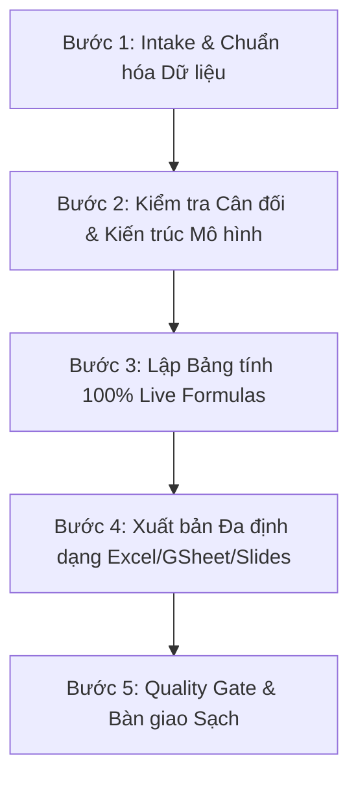

# KỸ NĂNG: BÁO CÁO KẾ TOÁN & DASHBOARD QUẢN TRỊ TÀI CHÍNH (`bao-cao-kt`)

> Chuyên gia phân tích tài chính - kế toán và quản trị số liệu kinh doanh. Tự động hóa việc chuẩn hóa dữ liệu thô, thiết lập mô hình tài chính với 100% công thức động (Live Formulas), vẽ biểu đồ trực quan và xuất bản đa định dạng: Microsoft Excel (.xlsx), Google Sheets, và Slides thuyết trình PowerPoint (.pptx).

---

## 1. NGUYÊN TẮC BẮT BUỘC & AN TOÀN HỆ THỐNG

1. **ZERO EXTERNAL API**:
   - Vận hành 100% bằng năng lực phân tích số liệu nội tại của LLM (Gemini 3.8) và các script Python cục bộ (`openpyxl`, `python-pptx`).
   - Tuyệt đối KHÔNG gọi API bên ngoài hoặc yêu cầu API key.
2. **QUY TẮC BẢO VỆ CODEBASE (Anti-Repo Bloat)**:
   - Toàn bộ file trung gian tạm thời lưu trong `<process_dir>`: `<workspace>/_process/<tên_báo_cáo>/`.
   - File kết quả xuất bản lưu vào `<output_dir>`: Do người dùng chỉ định hoặc **Mặc định: `~/Downloads/`**.
   - CẤM tự ý tạo file rác hoặc lưu file kết quả vào thư mục gốc của repository.
3. **NGUYÊN TẮC TỰ ĐỘNG CHẠY LIÊN TỤC (Autonomous Full-Run Protocol)**:
   - Tự thực hiện toàn bộ 5 bước từ bóc tách số liệu $\rightarrow$ kiểm tra cân đối $\rightarrow$ viết công thức $\rightarrow$ xuất bản file mà KHÔNG dừng lại xin phép giữa chừng.
4. **NGUYÊN TẮC "LIVE FORMULAS" 100%**:
   - Mọi ô tổng cộng, chênh lệch, tỷ suất, tăng trưởng trong bảng tính PHẢI là công thức Excel thực tế (`=SUM(...)`, `=AVERAGE(...)`, `=IF(...)`, `=C5-C6`, `=C8/C6`).
   - CẤM tính nhẩm bên ngoài rồi gán số chết vào ô kết quả.
5. **NGUYÊN TẮC ZERO-LOSS & EVIDENCE VERIFIER**:
   - Mọi con số doanh thu, chi phí, nợ phải thu, tồn kho từ nguồn dữ liệu thô của người dùng phải được đối chiếu bảo toàn 100%, không làm thất thoát một đồng nào.
   - Khi phát hiện số liệu mâu thuẫn hoặc bảng cân đối kế toán bị lệch, kích hoạt ngay cơ chế **Confidence Flagging**: gắn cờ `[CẦN XÁC MINH: LỆCH NỢ CÓ]` kèm giá trị chênh lệch.

---

## 2. QUY TRÌNH THỰC THI 5 BƯỚC



### BƯỚC 1: TIẾP NHẬN & CHUẨN HÓA DỮ LIỆU (INTAKE PROTOCOL)
- Xác định nguồn dữ liệu đầu vào:
  - Dữ liệu người dùng paste trực tiếp trong prompt (danh sách doanh thu, chi phí, công nợ).
  - File bảng tính Excel / CSV / TSV / Markdown table.
  - Yêu cầu xây dựng mô hình tài chính giả định từ con số zero.
- Xác định loại báo cáo:
  - Báo cáo Kết quả Kinh doanh (P&L - Thông tư 200).
  - Bảng Cân đối Kế toán (Balance Sheet).
  - Báo cáo Lưu chuyển Tiền tệ (Cash Flow).
  - Dashboard Quản trị Doanh thu & Chi phí (Executive KPI Dashboard).
- Xác định định dạng đầu ra mong muốn: `excel` (.xlsx), `gsheet` (Google Sheets), `slides` (.pptx) hoặc `all`.

### BƯỚC 2: KIỂM TRA CÂN ĐỐI & ĐỐI CHIẾU SỐ LIỆU (EVIDENCE VERIFIER)
- Kiểm tra tính logic và cân đối kế toán:
  - Với Bảng Cân đối Kế toán: $\text{Tổng Tài sản} = \text{Tổng Nguồn vốn}$. Nếu lệch $\rightarrow$ gắn cờ `[CẦN XÁC MINH: LỆCH BẢNG CÂN ĐỐI]`.
  - Với Báo cáo P&L: Kiểm tra Doanh thu thuần $\ge$ Giá vốn hàng bán; Lợi nhuận trước thuế = Lợi nhuận thuần + Lợi nhuận khác.
- Lập file dữ liệu JSON trung gian trong `<process_dir>/data.json`.

### BƯỚC 3: THIẾT LẬP BẢNG TÍNH VỚI 100% LIVE FORMULAS
- Tạo bảng tính Excel chuyên nghiệp bằng script `.agents/skills/bao-cao-kt/scripts/build_excel_dashboard.py`:
  - Sheet 1: `Dashboard` (Thẻ KPI, bảng tóm tắt, biểu đồ so sánh quý/tháng).
  - Sheet 2: `Báo cáo P&L` (Toàn bộ các dòng tổng và tỷ lệ đều dùng công thức Excel).
  - Áp dụng chuẩn kẻ viền kế toán: Viền đôi (double bottom border) cho dòng Lợi nhuận sau thuế.
  - Định dạng tiền tệ chuyên nghiệp: `#,##0 "₫"` hoặc `$#,##0.00`.

### BƯỚC 4: XUẤT BẢN FILE BÁO CÁO ĐA ĐỊNH DẠNG
Tùy theo yêu cầu của người dùng, thực thi xuất các định dạng tương ứng:
1. **Microsoft Excel (`.xlsx`)**:
   ```bash
   python3 .agents/skills/bao-cao-kt/scripts/build_excel_dashboard.py -i <process_dir>/data.json -o <output_dir>/bao_cao_tai_chinh.xlsx
   ```
2. **Google Sheets**:
   - File `.xlsx` được tối ưu 100% cho Google Sheets (dùng hàm chuẩn quốc tế, không lỗi `#NAME?`).
   - Hướng dẫn người dùng mở trực tiếp hoặc Import vào Google Drive / Google Sheets.
3. **Slides Thuyết trình PowerPoint (`.pptx`)**:
   ```bash
   python3 .agents/skills/bao-cao-kt/scripts/export_slides_deck.py -i <process_dir>/data.json -o <output_dir>/bao_cao_slides.pptx
   ```
   - Tạo bộ slide 16:9 cao cấp gồm Bìa, Executive Summary, Bảng số liệu và Khuyến nghị quản trị.

### BƯỚC 5: QUALITY GATE & BÀN GIAO SẠCH (DELIVERY)
- **Checklist nghiệm thu Quality Gate**:
  - [ ] 100% các ô tính toán tổng và biên lợi nhuận sử dụng Live Formulas (không hardcode số).
  - [ ] Đã qua đối chiếu Zero-Loss: Không làm thất thoát số liệu gốc của người dùng.
  - [ ] Khử dấu vết AI (anti-ai footprint): Báo cáo tài chính dùng văn phong chuyên nghiệp của chuyên viên tài chính, không dùng từ sáo rỗng ("bức tranh toàn cảnh", "bước tiến vượt bậc").
  - [ ] Tệp đầu ra tồn tại thực tế tại `<output_dir>` và mở được bình thường.

<delivery_protocol>
- **Giao thức Bàn giao Sạch (Clean Delivery Protocol)**:
  - Khung chat chỉ tóm tắt ngắn 3-5 chỉ số tài chính cốt lõi (Doanh thu, Lợi nhuận gộp, Lợi nhuận sau thuế, Biên lợi nhuận) + link trỏ đến file riêng.
  - Báo cáo đường dẫn file thực tế cho người dùng: `[file.xlsx](file:///Users/.../Downloads/file.xlsx)` và `[file.pptx](file:///Users/.../Downloads/file.pptx)`.
  - Không paste toàn bộ bảng tính hàng nghìn dòng làm ngập tràn khung chat của người dùng.
  - Hướng dẫn nhanh cách nhập vào Google Sheets hoặc trình chiếu PowerPoint.
</delivery_protocol>
