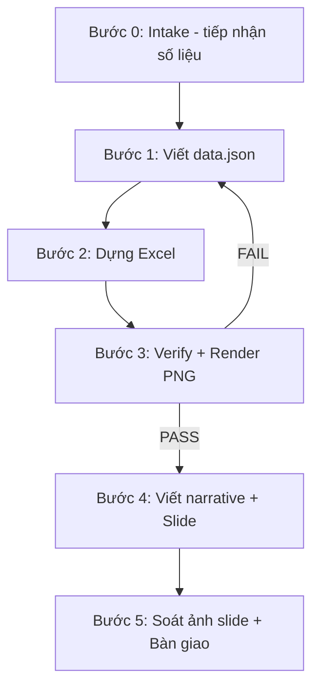

# KỸ NĂNG: BÁO CÁO KẾ TOÁN P&L & DASHBOARD (`bao-cao-kt`)

Đầu ra chuẩn của một lần chạy:
1. `<output_dir>/<ten_bao_cao>.xlsx` gồm sheet `Dashboard` (KPI + bảng theo kỳ + biểu đồ) và sheet `Báo cáo P&L` (mẫu B02, mọi dòng tổng/biên/tăng trưởng là công thức).
2. `<output_dir>/<ten_bao_cao>_slides.pptx` (khi người dùng cần trình chiếu).
3. Ảnh PNG review trong `<process_dir>/review/` mà Agent ĐÃ MỞ RA XEM trước khi bàn giao.

---

## 1. NGUYÊN TẮC BẮT BUỘC

1. **ZERO EXTERNAL API:** chỉ dùng năng lực của Agent trong IDE + script Python cục bộ (`openpyxl`, `python-pptx`, LibreOffice headless). Không gọi API ngoài, không đòi API key.
2. **QUY TẮC BẢO VỆ CODEBASE (Anti-Repo Bloat):**
   - File trung gian (`data.json`, ảnh review) lưu ở `<process_dir>` = `<workspace>/_process/<ten_bao_cao>/` (đã có trong .gitignore).
   - File thành phẩm lưu ở `<output_dir>` do người dùng chỉ định, **mặc định `~/Downloads/AIWF_Output/`**. Không ghi file kết quả vào repo.
3. **Autonomous Full-Run:** khi đã đủ số liệu, chạy liền mạch Bước 1 đến Bước 5, không dừng xin phép giữa chừng. Chỉ dừng để HỎI khi thiếu số liệu bắt buộc (mục Bước 0).
4. **LIVE FORMULAS 100%:** script tự sinh công thức cho mã 10, 20, 30, 40, 50, 60, biên gộp, biên ròng, chênh lệch, tăng trưởng và mọi ô KPI. Agent KHÔNG tính nhẩm rồi gõ số vào các ô này, KHÔNG sửa tay công thức trong file.
5. **KHÔNG BỊA SỐ (Zero-Loss & Evidence Verifier):** mọi số nhập phải lấy từ dữ liệu người dùng. Không có số thì hỏi, hoặc bỏ dòng đó khỏi `pnl`; không điền số "minh họa". Số chưa chắc chắn (đọc từ ảnh mờ, người dùng nói "khoảng") phải được ghi chú `[CẦN XÁC MINH]` trong `narrative` và trong tin nhắn bàn giao (**Confidence Flagging**).
6. **Script không có dữ liệu mẫu:** thiếu `-i`, sai đường dẫn, sai schema thì script in `❌ LỖI DỮ LIỆU ...` và thoát mã 2. Đọc thông báo, sửa `data.json`, chạy lại. Không bao giờ "chạy thử không có -i".

---

## 2. QUY TRÌNH 6 BƯỚC


```mermaid
flowchart TD
    A[Bước 0: Intake - tiếp nhận số liệu] --> B[Bước 1: Viết data.json]
    B --> C[Bước 2: Dựng Excel]
    C --> D[Bước 3: Verify + Render PNG]
    D -->|FAIL| B
    D -->|PASS| E[Bước 4: Viết narrative + Slide]
    E --> F[Bước 5: Soát ảnh slide + Bàn giao]
```

### BƯỚC 0: INTAKE - TIẾP NHẬN SỐ LIỆU
Đọc toàn bộ dữ liệu người dùng đưa (paste, Excel, CSV, PDF báo cáo).

**Đọc tệp người dùng** (XLSX/XLS/ODS/CSV/PDF/DOCX/ảnh): không đọc thẳng tệp nhị phân. Từ gốc repo chạy `.venv/bin/python scripts/doc_ingest.py "<tệp>" --out ~/Downloads/AIWF_Output/_ingest/<tên_việc> --json` rồi đọc `source.md` + `manifest.json` (`warnings`). Mã thoát: `0` dùng `source.md` · `3` có trang scan → đọc ảnh `ocr_pages/*.png` bằng thị giác (nháp OCR trong `source.md` CHƯA kiểm chứng) · `2` hỏi người dùng đúng điều trong `manifest.message` (mật khẩu/hỏng), không đoán · `4` thiếu phụ thuộc → cài theo `manifest.message` (`bash scripts/auto-setup.sh`).
Rồi chạy `python3 .agents/skills/bao-cao-kt/scripts/tables_from_source.py <thư mục ingest> -o <process_dir>/tables.json`: script chuẩn hoá số kiểu VN (`1.234.567`, `(1.234)` âm), gom các dòng có cột "Mã số" thành `pnl_candidates` kèm nguồn (ô `Sheet 'KQKD' ô D7` / `trang N`) và đối chiếu mã tổng 10–60 (`check_totals`). Cách map sang data.json: `templates/data_schema.md` mục "Nhập từ tệp". Số đọc từ trang scan (mã 3) luôn gắn `[CẦN XÁC MINH]`.

Xác định:
- **Chế độ kế toán** → `regime`: DN nhỏ và vừa áp dụng TT133 → `"TT133"` (chi phí gộp mã 24). DN áp dụng TT200 → `"TT200"` (mã 25, 26). Kỳ từ năm 2026 trở đi: xem ghi chú TT99 ở mục 3. Không rõ thì HỎI người dùng.
- **Kỳ báo cáo** và có so sánh kỳ trước hay không.
- **Thuế TNDN mã 51**: có số trên tờ khai quyết toán không. Không có thì cần thuế suất để ước tính (mục 3). Không tự chọn 20%.
- **Bắt buộc có**: doanh thu (01) và giá vốn (11). Thiếu thì hỏi, không đoán.

### BƯỚC 1: VIẾT `data.json`
- Mở và đọc `templates/data_schema.md` và `templates/data_example.json` trước khi viết. Viết file vào `<process_dir>/data.json` theo đúng schema.
- Ví dụ khối `pnl` cho DN theo TT133 không có thu nhập khác:
  ```json
  "regime": "TT133",
  "pnl": {
    "01": {"curr": 2700000000, "prev": 2100000000},
    "11": {"curr": 1600000000, "prev": 1300000000},
    "22": {"curr": 20000000, "prev": 25000000},
    "24": {"curr": 550000000, "prev": 480000000}
  },
  "cit": {"rate": {"curr": 0.15, "prev": 0.20}}
  ```
- Đối chiếu Zero-Loss: cộng tay lại tổng các khoản đã nhập so với file nguồn trước khi chạy script. Có `quarterly` thì tổng các kỳ phải bằng số năm (verify sẽ bắt lệch).

### BƯỚC 2: DỰNG EXCEL
```bash
python3 .agents/skills/bao-cao-kt/scripts/build_excel_dashboard.py -i <process_dir>/data.json -o <output_dir>/<ten_bao_cao>.xlsx
```

### BƯỚC 3: VERIFY + RENDER (Quality Gate tự động, KHÔNG được bỏ qua)
```bash
python3 .agents/skills/bao-cao-kt/scripts/verify_report.py --xlsx <output_dir>/<ten_bao_cao>.xlsx -i <process_dir>/data.json --render-dir <process_dir>/review
```
Script recalc bằng LibreOffice (tự tìm `soffice` trong PATH, `/Applications/LibreOffice.app`, Program Files, hoặc biến `SOFFICE`), rồi:
- FAIL nếu có ô `#REF!`, `#DIV/0!`, `#NAME?`, `#VALUE!`, ô công thức rỗng.
- FAIL nếu thẻ KPI rỗng hoặc bằng 0.
- FAIL nếu số Excel lệch mô hình Python tính độc lập từ data.json (sai số > 1 đồng).
- FAIL nếu bảng theo kỳ lệch P&L. Nếu lệch là do dữ liệu nguồn thật sự lệch: ghi `[CẦN XÁC MINH: bảng quý lệch P&L X đồng]` vào narrative, rồi mới chạy lại với `--allow-recon-diff`.
- Xuất PNG từng trang vào `<process_dir>/review/<ten>_xlsx/`.

Exit khác 0 → sửa data.json, quay lại Bước 2. **Sau khi PASS, MỞ TỪNG ẢNH PNG bằng công cụ xem ảnh** và soát: ô hiện `####` (cột hẹp), chữ tràn, biểu đồ bị cắt trang, thẻ KPI trống, đơn vị tính đúng. Thấy lỗi thì sửa và render lại.

### BƯỚC 4: NARRATIVE + SLIDE (khi người dùng cần trình chiếu)
1. Viết `narrative` vào data.json DỰA TRÊN SỐ ĐÃ VERIFY (lấy từ ảnh review hoặc từ sheet đã recalc):
   - `highlights`: 2-4 câu, mỗi câu có số cụ thể và nguyên nhân người dùng cung cấp. Ví dụ tốt: "Doanh thu thuần tăng 28,6% nhờ hai hợp đồng xuất khẩu mới trong quý 4." Ví dụ xấu (cấm): "Doanh thu tăng trưởng mạnh mẽ, bức tranh toàn cảnh khởi sắc."
   - Không biết nguyên nhân thì chỉ nêu số, không bịa lý do.
   - `recommendations`: 2-3 mục hành động gắn với chỉ tiêu cụ thể. Không có cơ sở thì bỏ trống, slide khuyến nghị sẽ tự bị bỏ.
2. Chạy:
   ```bash
   python3 .agents/skills/bao-cao-kt/scripts/export_slides_deck.py -i <process_dir>/data.json --xlsx <output_dir>/<ten_bao_cao>.xlsx -o <output_dir>/<ten_bao_cao>_slides.pptx
   ```
   `--xlsx` buộc slide khớp từng số với Excel đã recalc; lệch → thoát mã 1.

### BƯỚC 5: SOÁT SLIDE + BÀN GIAO
```bash
python3 .agents/skills/bao-cao-kt/scripts/verify_report.py --xlsx <output_dir>/<ten_bao_cao>.xlsx -i <process_dir>/data.json --pptx <output_dir>/<ten_bao_cao>_slides.pptx --render-dir <process_dir>/review
```
Mở từng ảnh trong `<process_dir>/review/<ten>_pptx/`. So số trên slide với sheet P&L, soát chữ tràn khung, câu sáo rỗng, dấu `—`.

---

## 3. THAM CHIẾU NGHIỆP VỤ

### Mẫu biểu (`regime`)
| regime | Mẫu | Chi phí hoạt động | Ghi chú |
|---|---|---|---|
| `TT200` | B02-DN, TT 200/2014/TT-BTC | 25 + 26 | 30 = 20 + (21 - 22) - (25 + 26); 60 = 50 - 51 - 52 |
| `TT133` | B02-DNN, TT 133/2016/TT-BTC | 24 | 30 = 20 + 21 - 22 - 24; 60 = 50 - 51 |
| `TT99` | B02-DN, TT 99/2025/TT-BTC | 25 + 26 | **[CẦN XÁC MINH]** TT 99/2025/TT-BTC được cho là thay thế TT200 từ 01/01/2026; kho tri thức `.agents/knowledge/` chưa có văn bản gốc để xác nhận mẫu biểu và mã số chỉ tiêu. Script dùng bố cục B02-DN của TT200 và in nhãn cảnh báo. Báo người dùng điều này. |

### Thuế suất TNDN để ước tính mã 51
Theo Luật Thuế TNDN số 67/2025/QH15 (áp dụng từ kỳ tính thuế năm 2025; kho tri thức có mục lục văn bản này):
| Trường hợp | Thuế suất |
|---|---|
| Phổ thông | 20% |
| DN có tổng doanh thu năm trên 3 tỷ đến không quá 50 tỷ đồng | 17% |
| DN có tổng doanh thu năm không quá 3 tỷ đồng | 15% |

[CẦN XÁC MINH] Điều kiện loại trừ và cách xác định "tổng doanh thu năm" theo NĐ 320/2025/NĐ-CP. Kỳ tính thuế trước 2025 dùng 20%. Ước tính = lợi nhuận kế toán trước thuế x thuế suất, CHƯA điều chỉnh chi phí không được trừ, thu nhập miễn thuế, lỗ chuyển kỳ. Có tờ khai quyết toán thì nhập số thực tế vào `pnl["51"]`.

Chuẩn định dạng, kẻ viền, màu: `standards/financial_rules.md`. Biểu đồ: `resources/chart_definitions.md`.

---

## 4. QUALITY GATE - CHECKLIST TRƯỚC KHI BÀN GIAO

- [ ] `verify_report.py` in `✅ QUALITY GATE PASS` (dán dòng này vào nhật ký làm việc).
- [ ] Đã MỞ XEM mọi PNG trong `<process_dir>/review/` (xlsx và pptx), không có `####`, chữ tràn, KPI trống.
- [ ] Mọi số nhập có nguồn trong dữ liệu người dùng; số không chắc đã gắn `[CẦN XÁC MINH]`.
- [ ] Mã 51 là số thực tế, hoặc là ước tính đã nói rõ thuế suất và cờ xác minh.
- [ ] Narrative có số cụ thể, không câu sáo ("bức tranh toàn cảnh", "bước tiến vượt bậc", "mạnh mẽ"), không em dash `—`.
- [ ] File nằm tại `<output_dir>`, không nằm trong repo.

<delivery_protocol>
**Giao thức Bàn giao Sạch (Clean Delivery):** khung chat chỉ gồm:
- 3-5 chỉ số: Doanh thu thuần, Lợi nhuận gộp + biên gộp, Lợi nhuận sau thuế + biên ròng, tăng trưởng (nếu có kỳ trước). Lấy số từ sheet đã verify.
- Các cờ `[CẦN XÁC MINH]` còn mở (thuế suất ước tính, TT99, dữ liệu lệch).
- Link trỏ đến file: `[ten_bao_cao.xlsx](file:///Users/<user>/Downloads/AIWF_Output/ten_bao_cao.xlsx)` và file .pptx.
- Cách mở trên Google Sheets: Google Drive → Tải lên → mở bằng Google Trang tính (công thức dùng hàm chuẩn SUM/IF/ROUND/MAX nên giữ nguyên).
Không dán toàn bộ bảng tính vào chat.
</delivery_protocol>
