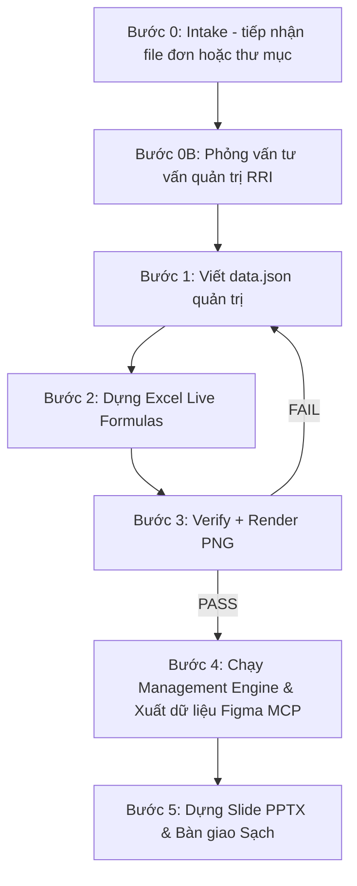

# KỸ NĂNG: BÁO CÁO TÀI CHÍNH & QUẢN TRỊ (`bao-cao-kt`)

Đầu ra chuẩn của một lần chạy:
1. `<output_dir>/<ten_bao_cao>.xlsx` gồm sheet `Dashboard` (KPI + bảng theo kỳ + biểu đồ) và sheet `Báo cáo P&L` (mẫu B02, 100% dòng tổng/biên/tăng trưởng là công thức sống).
2. `<output_dir>/<ten_bao_cao>_slides.pptx` (slide thuyết trình quản trị 16:9 tương thích Google Slides).
3. `<output_dir>/management_report.json` và `<output_dir>/executive_summary.md` (dữ liệu quản trị chuẩn hóa sẵn sàng liên kết với Figma qua MCP).
4. Ảnh PNG review trong `<process_dir>/review/` mà Agent ĐÃ MỞ RA XEM trước khi bàn giao.

---

## 1. NGUYÊN TẮC BẮT BUỘC

1. **ZERO EXTERNAL API:** chỉ dùng năng lực của Agent trong IDE + script Python cục bộ (`openpyxl`, `python-pptx`, LibreOffice headless). Không gọi API ngoài, không đòi API key.
2. **QUY TẮC BẢO VỆ CODEBASE (Anti-Repo Bloat):**
   - File trung gian (`data.json`, ảnh review) lưu ở `<process_dir>` = `<workspace>/_process/<ten_bao_cao>/` (đã có trong .gitignore).
   - File thành phẩm lưu ở `<output_dir>` do người dùng chỉ định, **mặc định `~/Downloads/AIWF_Output/`**. Không ghi file kết quả vào repo.
3. **Autonomous Full-Run:** khi đã đủ số liệu và hoàn thành phỏng vấn tư vấn, chạy liền mạch Bước 1 đến Bước 5, không dừng xin phép giữa chừng. Chỉ dừng để HỎI khi thiếu số liệu bắt buộc hoặc ở Bước 0B phỏng vấn quản trị.
4. **LIVE FORMULAS 100%:** script tự sinh công thức cho mã 10, 20, 30, 40, 50, 60, biên gộp, biên ròng, chênh lệch, tăng trưởng và mọi ô KPI. Agent KHÔNG tính nhẩm rồi gõ số vào các ô này, KHÔNG sửa tay công thức trong file.
5. **KHÔNG BỊA SỐ (Zero-Loss & Evidence Verifier):** mọi số nhập phải lấy từ dữ liệu người dùng. Không có số thì hỏi, hoặc bỏ dòng đó khỏi `pnl`; không điền số "minh họa". Số chưa chắc chắn (đọc từ ảnh mờ, người dùng nói "khoảng") phải được ghi chú `[CẦN XÁC MINH]` trong `narrative` và trong tin nhắn bàn giao (**Confidence Flagging**).
6. **Script không có dữ liệu mẫu:** thiếu `-i`, sai đường dẫn, sai schema thì script in `❌ LỖI DỮ LIỆU ...` và thoát mã 2. Đọc thông báo, sửa `data.json`, chạy lại.

---

## 2. QUY TRÌNH 6 BƯỚC


```mermaid
flowchart TD
    A[Bước 0: Intake - tiếp nhận file đơn hoặc thư mục] --> B[Bước 0B: Phỏng vấn tư vấn quản trị RRI]
    B --> C[Bước 1: Viết data.json quản trị]
    C --> D[Bước 2: Dựng Excel Live Formulas]
    D --> E[Bước 3: Verify + Render PNG]
    E -->|FAIL| C
    E -->|PASS| F[Bước 4: Chạy Management Engine & Xuất dữ liệu Figma MCP]
    F --> G[Bước 5: Dựng Slide PPTX & Bàn giao Sạch]
```

### BƯỚC 0: INTAKE - TIẾP NHẬN SỐ LIỆU ĐA TỆP HOẶC THƯ MỤC
Đọc toàn bộ dữ liệu người dùng đưa (paste, Excel, CSV, PDF báo cáo, hoặc thư mục chứa nhiều file kế toán).

**Đọc tệp hoặc thư mục người dùng:**
- **Tệp đơn:** `.venv/bin/python scripts/doc_ingest.py "<tệp>" --out ~/Downloads/AIWF_Output/_ingest/<tên_việc> --json`
- **Thư mục nhiều tệp:** `.venv/bin/python scripts/doc_ingest.py "<thư_mục>"/* --out ~/Downloads/AIWF_Output/_ingest/<tên_việc> --json`
- Đọc `source.md` + `manifest.json`. Rồi chạy:
  `python3 .agents/skills/bao-cao-kt/scripts/tables_from_source.py <thư mục ingest> -o <process_dir>/tables.json`
  Script tự động quét mọi bảng biểu qua các sheet (KQHĐKD, CĐKT, LCTT, Doanh số theo dòng hàng/sàn) và chuẩn hoá số kiểu VN.

### BƯỚC 0B: PHỎNG VẤN TƯ VẤN QUẢN TRỊ (RRI - MANAGEMENT CONSULTATION)
Trước khi lập báo cáo quản trị, Agent **bắt buộc dừng lại hỏi người dùng 4 chiều thông tin định hình**:
1. **Đối tượng người nghe chính:**
   - (A) Hội đồng Quản trị / Cổ đông / Nhà đầu tư: Trọng tâm vào Topline Doanh thu, EBITDA, Lợi nhuận ròng, An toàn dòng tiền, Tỷ suất sinh lời và Cổ tức.
   - (B) Ban Giám đốc (CEO/COO): Trọng tâm vào Hiệu quả vận hành, Biên lợi nhuận gộp từng nhóm hàng, Kiểm soát chi phí OPEX, Điểm hòa vốn.
   - (C) Trưởng các phòng ban (Sales / Marketing / Vận hành): Trọng tâm vào Doanh số từng kênh (Offline vs TMĐT), Hiệu quả chi phí quảng cáo (Marketing ROI / CAC), Vòng quay tồn kho.
2. **Quy mô và độ dài slide:**
   - Executive Brief (4 - 6 slide) - Ngắn gọn, tập trung chỉ số và quyết sách nhanh.
   - Standard FP&A Review (8 - 12 slide) - Đầy đủ P&L, Cơ cấu chi phí, Dòng tiền, Biểu đồ và Hành động.
   - Comprehensive Deep-Dive (15 - 20 slide) - Toàn diện cả Bảng cân đối, Vốn lưu động (CCC, nợ, tồn kho).
3. **Mức độ chi tiết dữ liệu:**
   - High-level (Dashboard tổng quan).
   - Mid-level (Phân tích tỷ trọng % và biến động theo quý).
   - Granular (Kèm bảng số liệu chi tiết đến từng khoản mục con và thuyết minh).
4. **Trọng tâm chiến lược cần mổ xẻ:**
   - Biên lợi nhuận gộp & Giá vốn nhập khẩu / Tỷ giá.
   - Hiệu quả chi phí Marketing & Doanh số sàn TMĐT.
   - Vốn lưu động, Chu kỳ tiền mặt (DSO/DIO/DPO) & Kế hoạch thuế TNDN.

### BƯỚC 1: VIẾT `data.json` TÍCH HỢP QUẢN TRỊ
- Mở và đọc `templates/data_schema.md`. Viết file vào `<process_dir>/data.json`.
- Ngoài khối `pnl`, bổ sung các khối quản trị nếu dữ liệu nguồn có:
  * `balance_sheet`: `receivables`, `inventory`, `payables`, `current_assets`, `current_liabilities`.
  * `cost_behavior`: `variable_selling` (ước tính biến phí bán hàng).
  * `channels`: Phân rã doanh số theo dòng sản phẩm hoặc kênh (TMĐT vs Trực tiếp).
  * `cash`, `deposits`, `debt`.

### BƯỚC 2: DỰNG EXCEL
```bash
python3 .agents/skills/bao-cao-kt/scripts/build_excel_dashboard.py -i <process_dir>/data.json -o <output_dir>/<ten_bao_cao>.xlsx
```

### BƯỚC 3: VERIFY + RENDER (Quality Gate tự động, KHÔNG được bỏ qua)
```bash
python3 .agents/skills/bao-cao-kt/scripts/verify_report.py --xlsx <output_dir>/<ten_bao_cao>.xlsx -i <process_dir>/data.json --render-dir <process_dir>/review
```
LibreOffice tự động recalc, kiểm tra không có ô lỗi (`#REF!`, `#DIV/0!`), không có KPI rỗng, đối chiếu chéo Python vs Excel đạt 100% khớp (sai số <= 1 đồng). Xuất PNG review.

### BƯỚC 4: CHẠY ĐỘNG CƠ PHÂN TÍCH QUẢN TRỊ & XUẤT DỮ LIỆU FIGMA MCP
Chạy module phân tích quản trị CFO:
```bash
python3 .agents/skills/bao-cao-kt/scripts/management_engine.py -i <process_dir>/data.json -o <output_dir>/management_report.json --md <output_dir>/executive_summary.md
```
- Tự động tính toán: Lợi nhuận đóng góp (Contribution Margin), Điểm hòa vốn (Break-even), Chu kỳ tiền mặt (CCC: DSO, DIO, DPO), Tỷ số thanh toán hiện hành, Dự trữ tiền mặt & Cash Runway.
- Tạo thẻ điểm CFO Financial Health Scorecard (Xanh / Vàng / Đỏ) và Báo cáo tóm tắt điều hành Executive Summary.
- File `management_report.json` sẵn sàng cho Agent liên kết với Figma qua MCP (Stitch / Figma plugins) để đổ trực tiếp dữ liệu vào khung slide thiết kế.

### BƯỚC 5: DỰNG SLIDE PPTX & BÀN GIAO SẠCH
```bash
python3 .agents/skills/bao-cao-kt/scripts/export_slides_deck.py -i <process_dir>/data.json --xlsx <output_dir>/<ten_bao_cao>.xlsx -o <output_dir>/<ten_bao_cao>_slides.pptx
python3 .agents/skills/bao-cao-kt/scripts/verify_report.py --xlsx <output_dir>/<ten_bao_cao>.xlsx -i <process_dir>/data.json --pptx <output_dir>/<ten_bao_cao>_slides.pptx --render-dir <process_dir>/review
```
Mở soát toàn bộ PNG trong `<process_dir>/review/`. Đảm bảo chữ không tràn khung, số liệu khớp từng đồng và không dùng dấu gạch ngang dài `—`.

---

## 3. THAM CHIẾU NGHIỆP VỤ

### Mẫu biểu (`regime`)
| regime | Mẫu | Chi phí hoạt động | Ghi chú |
|---|---|---|---|
| `TT200` | B02-DN, TT 200/2014/TT-BTC | 25 + 26 | 30 = 20 + (21 - 22) - (25 + 26); 60 = 50 - 51 - 52 |
| `TT133` | B02-DNN, TT 133/2016/TT-BTC | 24 | 30 = 20 + 21 - 22 - 24; 60 = 50 - 51 |
| `TT99` | B02-DN, TT 99/2025/TT-BTC | 25 + 26 | **[CẦN XÁC MINH]** TT 99/2025/TT-BTC áp dụng cho kỳ từ 2026; script dùng bố cục B02-DN của TT200 và in nhãn cảnh báo. |

### Thuế suất TNDN để ước tính mã 51
Theo Luật Thuế TNDN số 67/2025/QH15 (áp dụng từ kỳ tính thuế năm 2025):
- Phổ thông: 20%.
- DN tổng doanh thu năm trên 3 tỷ đến 50 tỷ đồng: 17%.
- DN tổng doanh thu năm không quá 3 tỷ đồng: 15%.

---

## 4. QUALITY GATE - CHECKLIST TRƯỚC KHI BÀN GIAO

- [ ] `verify_report.py` in `✅ QUALITY GATE PASS`.
- [ ] Đã MỞ XEM mọi PNG trong `<process_dir>/review/` (xlsx và pptx), không có `####`, chữ tràn, KPI trống.
- [ ] Đã chạy `management_engine.py` xuất `management_report.json` và `executive_summary.md`.
- [ ] Mọi số nhập có nguồn trong dữ liệu người dùng; số không chắc đã gắn `[CẦN XÁC MINH]`.
- [ ] Narrative có số cụ thể, mổ xẻ nguyên nhân (Root Cause), không câu sáo, không em dash `—`.
- [ ] File nằm tại `<output_dir>`, không nằm trong repo.

<delivery_protocol>
**Giao thức Bàn giao Sạch (Clean Delivery):** khung chat chỉ gồm:
- 3-5 chỉ số tài chính và quản trị: Doanh thu thuần, Biên lợi nhuận gộp, Lợi nhuận đóng góp (CM Ratio), Lợi nhuận sau thuế, Chu kỳ tiền mặt CCC và Thời gian tiền mặt duy trì (Cash Runway).
- Bảng CFO Scorecard tóm tắt trạng thái sức khỏe tài chính (Xanh / Vàng / Đỏ).
- Các cờ `[CẦN XÁC MINH]` còn mở.
- Link trỏ đến file thành phẩm:
  * Bảng tính Excel: `[ten_bao_cao.xlsx](file:///Users/<user>/Downloads/AIWF_Output/ten_bao_cao.xlsx)`
  * Slide PowerPoint: `[ten_bao_cao_slides.pptx](file:///Users/<user>/Downloads/AIWF_Output/ten_bao_cao_slides.pptx)`
  * Dữ liệu quản trị cho Figma MCP: `[management_report.json](file:///Users/<user>/Downloads/AIWF_Output/management_report.json)`
  * Báo cáo điều hành Executive Briefing: `[executive_summary.md](file:///Users/<user>/Downloads/AIWF_Output/executive_summary.md)`
- Hướng dẫn mở trên Google Sheets và Google Slides.
Không dán toàn bộ bảng tính thô vào chat.
</delivery_protocol>

---

## 🧩 Engine dùng chung (Luật R7)

| Engine / công cụ | Dùng cho | Cách gọi |
|---|---|---|
| `scripts/doc_ingest.py` | Đọc tệp người dùng (PDF/DOCX/XLSX/PPTX/ảnh…) thành `source.md` + `manifest.json` | `.venv/bin/python scripts/doc_ingest.py "<tệp>" --out ~/Downloads/AIWF_Output/_ingest/<việc> --json` |
| `doc_ingest_bridge` | Gọi doc_ingest từ Python: `md_blocks`, `strip_md_inline` (bảng từ tài liệu nguồn) | import trong `scripts/tables_from_source.py` |
| `scripts/claim_guard.py` | Quét over-claim theo Luật R5 trước khi bàn giao | `python3 scripts/claim_guard.py --input <file> [--profile ads]` |
