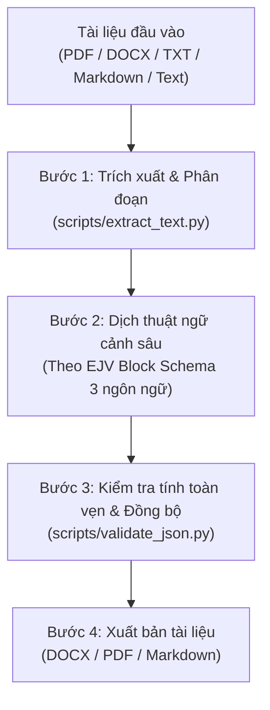

# EJV Trilingual Document Translator (VN - EN - JP)

Kế thừa và nâng cấp từ miniapp **EJV Translator** trong DocStudio, kết hợp sức mạnh xử lý bóc tách tài liệu (PDF, DOCX, TXT) và dịch thuật ngữ cảnh chuyên sâu 3 ngôn ngữ (Tiếng Việt, English, 日本語).

---

## 🎯 Khi nào sử dụng skill này?

- Dịch tài liệu (PDF, DOCX, Excel, Text, Markdown) sang **3 ngôn ngữ đồng thời** (VN, EN, JP) hoặc song ngữ bất kỳ.
- Yêu cầu dịch chính xác, bảo toàn 100% cấu trúc phân cấp (tiêu đề h1/h2/h3, đoạn văn p, danh sách ul/ol, bảng biểu table, trích dẫn blockquote, chú thích caption).
- Dịch văn bản hành chính (Administrative), báo cáo tiêu chuẩn (Standard) hoặc tài liệu học thuật/nghiên cứu (Academic).
- Xuất kết quả ra file hoàn chỉnh: `.docx` chuẩn định dạng in ấn, `.md` đối chiếu song song, hoặc tích hợp pipeline PDF.

---

## 🏗️ Kiến trúc quy trình xử lý (4 Bước)



---

## 📋 Bước 1: Trích xuất & Chuẩn bị nội dung

1. Nếu đầu vào là file **PDF**:
   - Sử dụng script trích xuất nội dung hoặc engine `pdf-translate` để đọc các khối văn bản, bảng biểu.
2. Nếu đầu vào là file **DOCX**:
   - Chạy `python scripts/extract_text.py --input <file.docx> --output <segments.json>`
3. Nếu đầu vào là **Text / Copy-Paste**:
   - Đọc trực tiếp nội dung và phân tích cấu trúc tài liệu.

---

## 🌐 Bước 2: Dịch thuật ngữ cảnh theo EJV Schema

Dịch toàn bộ nội dung sang 3 ngôn ngữ:
- `vn`: Tiếng Việt (chuẩn văn phong hành chính/kỹ thuật)
- `en`: English (chuẩn quốc tế)
- `ja`: 日本語 (chuẩn Keigo / Business Japanese / Kỹ thuật)

### 📌 Cấu trúc Block JSON chuẩn (EJV Schema)

```json
[
  {
    "type": "h1",
    "vn": "TIÊU ĐỀ CẤP 1",
    "en": "HEADING LEVEL 1",
    "ja": "見出しレベル1"
  },
  {
    "type": "h2",
    "vn": "Tiêu đề cấp 2",
    "en": "Heading Level 2",
    "ja": "見出しレベル2"
  },
  {
    "type": "p",
    "vn": "Nội dung đoạn văn tiếng Việt đầy đủ và chuẩn xác.",
    "en": "Full and accurate English paragraph content.",
    "ja": "完全で正確な日本語の段落内容。"
  },
  {
    "type": "ul",
    "vn": ["Mục 1", "Mục 2", "Mục 3"],
    "en": ["Item 1", "Item 2", "Item 3"],
    "ja": ["項目1", "項目2", "項目3"]
  },
  {
    "type": "table",
    "headers": {
      "vn": ["STT", "Hạng mục", "Thông số"],
      "en": ["No.", "Item", "Specification"],
      "ja": ["項番", "項目", "仕様"]
    },
    "rows": {
      "vn": [["1", "Điện áp", "220V"]],
      "en": [["1", "Voltage", "220V"]],
      "ja": [["1", "電圧", "220V"]]
    }
  },
  {
    "type": "blockquote",
    "vn": "Lưu ý quan trọng: ...",
    "en": "Important note: ...",
    "ja": "重要事項: ..."
  },
  { "type": "hr" }
]
```

### ⚠️ Quy tắc dịch bất biến (Golden Rules)
1. **Zero Meaning Loss**: Dịch đúng nghĩa gốc, không thêm thắt suy diễn.
2. **Preserve Identifiers & Numbers**: Giữ nguyên mã hiệu văn bản (Nghị định 37/2026/NĐ-CP), số liệu, ngày tháng, tên riêng, URL, thông số kỹ thuật.
3. **Symmetrical Structure**: Cả 3 ngôn ngữ phải có cùng số lượng phần tử mảng trong `ul`, `ol` và cùng số hàng/cột trong `table`.
4. **Batch Division**: Đối với văn bản dài (> 2000 từ), chia thành các batch tự nhiên (hết phần/mục) và nối tiếp.

---

## 🔍 Bước 3: Validate & Kiểm tra đồng bộ

Sử dụng script:
```bash
python scripts/validate_json.py --input <translations.json>
```
Script sẽ kiểm tra:
- Đúng chuẩn JSON Schema
- Không bị lệch số lượng phần tử giữa `vn`, `en`, `ja`
- Không có trường ngôn ngữ bị bỏ trống

---

## 📄 Bước 4: Xuất bản tài liệu

### 1. Xuất file DOCX hoàn chỉnh
```bash
python scripts/build_docx.py --input <translations.json> --style administrative --output "Bao_cao_dich.docx"
```
Các style hỗ trợ:
- `standard`: Phù hợp báo cáo doanh nghiệp (Font Inter/Calibri, 11pt)
- `administrative`: Văn bản hành chính nhà nước (Font Times New Roman, 13pt, lùi đầu dòng 1cm, căn đều 2 bên)
- `academic`: Bài báo khoa học, nghiên cứu (Font Arial, 11pt, cô đọng)

### 2. Xuất bảng so sánh đối chiếu Markdown (Parallel View)
```bash
python scripts/build_markdown.py --input <translations.json> --output "Bao_cao_song_ngu.md"
```

---

## 🔗 Tích hợp với skill `pdf-translate`

- **Khi cần giữ layout PDF gốc (Pixel-perfect)**: Điều phối qua `pdf-translate` để tái tạo layout PDF trực tiếp cho từng ngôn ngữ đích.
- **Khi cần dịch 3 ngôn ngữ thành văn bản tài liệu có thể chỉnh sửa**: Sử dụng `ejv-translate` để xuất ra DOCX / Markdown hoặc biên dịch lại thành ấn bản mới.
