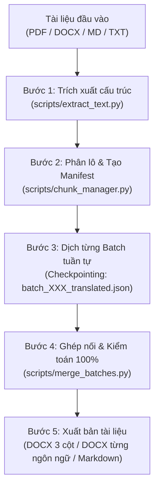

# EJV Trilingual Document Translator (VN - EN - JP)
## Anti-Token Overflow & Zero-Loss Architecture

Kế thừa và nâng cấp từ miniapp **EJV Translator** trong DocStudio, kết hợp sức mạnh xử lý bóc tách tài liệu (PDF, DOCX, TXT, MD) và dịch thuật ngữ cảnh chuyên sâu 3 ngôn ngữ (Tiếng Việt, English, 日本語) với cơ chế **Phân lô & Checkpoint chống tràn token (Zero-Loss Chunking)**.

---

## 🎯 Khi nào sử dụng skill này?

- Dịch tài liệu (PDF, DOCX, Excel, Text, Markdown) sang **3 ngôn ngữ đồng thời** (VN, EN, JP) hoặc song ngữ bất kỳ.
- Dịch văn bản dài (10 - 100+ trang như Nghị định, Luật, Hợp đồng, Báo cáo kỹ thuật) mà **không bị cắt xén hay tóm tắt dở dang**.
- Yêu cầu dịch chính xác, bảo toàn 100% cấu trúc phân cấp (tiêu đề h1/h2/h3, đoạn văn p, danh sách ul/ol, bảng biểu table, trích dẫn blockquote, chú thích caption).
- Xuất kết quả ra file hoàn chỉnh: `.docx` chuẩn in ấn, `.docx` bảng 3 cột đối chiếu song song, `.md` song song, hoặc dữ liệu EJV JSON.

---

## 🏗️ Kiến trúc quy trình xử lý 5 Bước (Zero-Loss Protocol)



---

## 📋 Hướng dẫn thực hiện chi tiết

### 📌 Bước 1: Trích xuất cấu trúc văn bản
Trích xuất toàn bộ các khối nội dung (Headings, Paragraphs, Lists, Tables) ra file trung gian:
```bash
python <skill_dir>/scripts/extract_text.py --input "<file_dau_vao>" --output "<process_dir>/extracted_blocks.json"
```

### 📌 Bước 2: Phân lô (Chunking) & Thiết lập Manifest
Đối với tài liệu vừa và dài (> 25 khối hoặc > 1000 từ), tự động chia thành các batch nhỏ an toàn:
```bash
python <skill_dir>/scripts/chunk_manager.py --input "<process_dir>/extracted_blocks.json" --process-dir "<process_dir>" --max-blocks 25 --max-words 1000
```
*Script sẽ tạo `manifest.json` và các file `batch_001_source.json`, `batch_002_source.json`... để quản lý tiến độ từng phần.*

### 📌 Bước 3: Dịch thuật ngữ cảnh sâu từng Batch (Checkpoint Loop)

> [!CAUTION]
> **Bước này PHẢI do chính Agent (LLM) thực hiện — TUYỆT ĐỐI KHÔNG dùng script Python regex/dictionary để "giả dịch".**
> Script Python KHÔNG CÓ khả năng dịch thuật pháp lý chính xác. Nếu agent ghi nguyên bản tiếng Việt vào cột EN/JA thì coi như CHƯA DỊCH.

Agent duyệt tuần tự từng batch (3–5 batches mỗi lượt, tùy độ dài):
1. **Đọc** nội dung `batch_XXX_source.json` (chứa danh sách blocks tiếng Việt gốc).
2. **Dịch thật** từng block sang 3 ngôn ngữ (`vn` giữ nguyên, `en` dịch chính xác, `ja` dịch chính xác) bằng chính khả năng ngôn ngữ của agent.
3. **Ghi kết quả** vào `batch_XXX_translated.json` (JSON array cùng số lượng blocks, cùng cấu trúc type).
4. **Cập nhật manifest**: đánh dấu batch đó là `completed`.
5. Nếu gặp gián đoạn giữa chừng, agent chỉ cần kiểm tra `manifest.json` để tìm các batch `pending` và dịch tiếp.

**Quy tắc dịch thuật bắt buộc:**
- `vn`: Giữ nguyên text gốc tiếng Việt, không sửa đổi.
- `en`: Dịch sang tiếng Anh chuẩn pháp lý / hành chính quốc tế. Dùng thuật ngữ chuyên ngành (CGMP-ASEAN, PIF, CFS, INCI...).
- `ja`: Dịch sang tiếng Nhật chuẩn văn phong công vụ (法令文体). Dùng kính ngữ hành chính (ですます thể hoặc である thể tùy loại văn bản).
- **Mọi con số, ngày tháng, tên riêng, mã số văn bản**: Giữ nguyên giá trị, chỉ điều chỉnh định dạng theo quy ước từng ngôn ngữ.
- **Cấm**: Tóm tắt, lược bỏ, thay thế bằng placeholder "[...]", hoặc ghi "tương tự như trên".

#### Cấu trúc Block JSON chuẩn (EJV Schema)
```json
[
  {
    "type": "h1",
    "vn": "TIÊU ĐỀ CẤP 1",
    "en": "HEADING LEVEL 1",
    "ja": "見出しレベル1"
  },
  {
    "type": "p",
    "vn": "Nội dung đoạn văn tiếng Việt đầy đủ và chuẩn xác.",
    "en": "Full and accurate English paragraph content.",
    "ja": "完全で正確な日本語の段落内容。"
  },
  {
    "type": "ul",
    "vn": ["Mục 1", "Mục 2"],
    "en": ["Item 1", "Item 2"],
    "ja": ["項目1", "項目2"]
  },
  {
    "type": "table",
    "headers": {
      "vn": ["STT", "Hạng mục", "Kết quả"],
      "en": ["No.", "Item", "Result"],
      "ja": ["項番", "項目", "結果"]
    },
    "rows": {
      "vn": [["1", "Thông số A", "Đạt"], ["2", "Thông số B", "Đạt"]],
      "en": [["1", "Parameter A", "Pass"], ["2", "Parameter B", "Pass"]],
      "ja": [["1", "パラメータA", "合格"], ["2", "パラメータB", "合格"]]
    }
  },
  {
    "type": "meta_table",
    "items": [
      {
        "label": {"vn": "Số lô sản xuất", "en": "Batch Number", "ja": "ロット番号"},
        "value": {"vn": "LOT-2026-001", "en": "LOT-2026-001", "ja": "LOT-2026-001"}
      },
      {
        "label": {"vn": "Ngày sản xuất", "en": "Manufacturing Date", "ja": "製造日"},
        "value": {"vn": "15/03/2026", "en": "March 15, 2026", "ja": "2026年3月15日"}
      }
    ]
  }
]
```

#### Quy tắc bảng nâng cao:
- **`table`**: Bảng dữ liệu chuẩn (≥3 cột) — dùng cho bảng kết quả, bảng thống kê, phụ lục.
- **`meta_table`**: Bảng key-value (2 cột: nhãn | giá trị) — dùng cho thông tin mẫu, metadata, thông tin chung. Render với cột nhãn in đậm nền xám.
- Nếu `label`/`value` **không cần dịch** (số, mã, tên riêng): dùng string trực tiếp thay vì dict 3 ngôn ngữ.
- Bảng trải nhiều trang: hệ thống tự ghép (cross-page merging) nếu headers giống nhau.
- Cell trống: ghi `""` (không bỏ qua), đảm bảo đồng bộ số cột giữa 3 ngôn ngữ.

### 📌 Bước 4: Ghép nối & Kiểm tra toàn vẹn 100% (Zero-Loss Audit)
Ghép toàn bộ các batch đã dịch thành file hoàn chỉnh:
```bash
python <skill_dir>/scripts/merge_batches.py --process-dir "<process_dir>" --output "<process_dir>/merged_ejv.json"
```
*Script sẽ kiểm toán số lượng block đầu vào so với đầu ra. Nếu tỷ lệ hoàn thành < 100% hoặc có block bị thiếu, script sẽ cảnh báo vị trí chính xác cần bổ sung.*

Kiểm tra cú pháp và độ hoàn thiện 3 ngôn ngữ:
```bash
python <skill_dir>/scripts/validate_json.py --input "<process_dir>/merged_ejv.json"
```

### 📌 Bước 5: Xuất bản tài liệu đa định dạng

#### 1. Xuất file Word DOCX từng ngôn ngữ:
```bash
# Tiếng Việt (chuẩn hành chính):
python <skill_dir>/scripts/build_docx.py --input "<process_dir>/merged_ejv.json" --output "<output_dir>/[Ten]_vi.docx" --lang vn --style administrative

# Tiếng Anh (chuẩn quốc tế):
python <skill_dir>/scripts/build_docx.py --input "<process_dir>/merged_ejv.json" --output "<output_dir>/[Ten]_en.docx" --lang en --style standard

# Tiếng Nhật:
python <skill_dir>/scripts/build_docx.py --input "<process_dir>/merged_ejv.json" --output "<output_dir>/[Ten]_ja.docx" --lang ja --style standard
```

#### 2. Xuất Bảng đối chiếu Markdown (Parallel View):
```bash
python <skill_dir>/scripts/build_markdown.py --input "<process_dir>/merged_ejv.json" --output "<output_dir>/[Ten]_tam_ngu_parallel.md" --mode parallel
```

#### 3. 🆕 Xuất bản giữ cấu trúc gốc (Layout Preservation):
> Tính năng này clone file gốc (DOCX hoặc PDF) và **thay thế text tại chỗ** bằng bản dịch,
> giữ nguyên 100% formatting: fonts, margins, page breaks, table borders, images, header/footer.

```bash
# Tiếng Anh — giữ layout gốc:
python <skill_dir>/scripts/layout_preserve.py --source "<file_goc>" --blocks "<process_dir>/merged_ejv.json" --lang en --output "<output_dir>/[Ten]_preserved_en.docx"

# Tiếng Nhật — giữ layout gốc:
python <skill_dir>/scripts/layout_preserve.py --source "<file_goc>" --blocks "<process_dir>/merged_ejv.json" --lang ja --output "<output_dir>/[Ten]_preserved_ja.docx"
```

**Lưu ý**: File output sẽ có cùng định dạng với file gốc (.docx → .docx, .pdf → .pdf). Các block không match được sẽ giữ nguyên text gốc (safe behavior).

---

## ⚠️ Quy tắc dịch bất biến (Golden Rules)

1. **Anti-Token Overflow**: Tuyệt đối KHÔNG cố dịch toàn bộ văn bản dài trong một prompt duy nhất. Bắt buộc sử dụng quy trình phân lô `chunk_manager` và checkpoint.
2. **Zero Meaning Loss & Zero Text Skipping**: Không được tóm tắt, không được bỏ qua điều khoản/đoạn văn nào.
3. **Preserve Identifiers & Numbers**: Giữ nguyên mã hiệu văn bản (Nghị định 37/2026/NĐ-CP), số liệu, ngày tháng, tên riêng, URL, thông số kỹ thuật.
4. **Symmetrical Structure**: Cả 3 ngôn ngữ phải có cùng số lượng phần tử mảng trong `ul`, `ol` và cùng số hàng/cột trong `table`.
