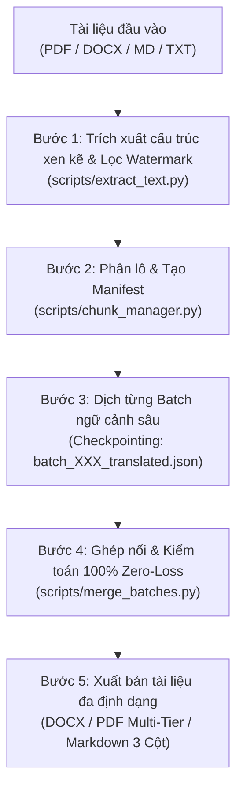

# EJV Trilingual Document Translator (VN - EN - JP)
## Anti-Token Overflow & Zero-Loss Architecture

Kế thừa và nâng cấp từ miniapp **EJV Translator** trong DocStudio, kết hợp sức mạnh xử lý bóc tách tài liệu (PDF, DOCX, TXT, MD) và dịch thuật ngữ cảnh chuyên sâu 3 ngôn ngữ (Tiếng Việt, English, 日本語) với cơ chế **Phân lô & Checkpoint chống tràn token (Zero-Loss Chunking)** và **Quy trình tái tạo cấu trúc chuẩn in ấn (DOCX-First Publication Pipeline)**.

---

> [!CAUTION]
> **NGUYÊN TẮC NỀN TẢNG: CHẠY 100% TRÊN ANTIGRAVITY (ZERO EXTERNAL API)**
> - Skill này chạy hoàn toàn bằng khả năng tích hợp sẵn của Antigravity IDE.
> - TUYỆT ĐỐI KHÔNG gọi REST API bên ngoài (Gemini API, OpenAI API, etc.) hoặc yêu cầu API key.
> - Toàn bộ năng lực dịch thuật là của chính Agent (LLM tích hợp sẵn trong Antigravity).
> - Python scripts chỉ phục vụ: bóc tách dữ liệu, merge, validate, xuất bản file — KHÔNG chứa logic AI.
> - Khi được kích hoạt, skill PHẢI tự chạy liên tục cho đến khi hoàn tất 100% — KHÔNG tự dừng giữa chừng.

---

## 🔧 Path Resolution — Xác định đường dẫn tự động

Agent PHẢI resolve các placeholder trong các lệnh dưới đây:

| Placeholder | Cách xác định |
|-------------|--------------|
| `<skill_dir>` | Thư mục chứa SKILL.md này: `.agents/skills/ejv-translate/` (relative từ workspace root) |
| `<process_dir>` | Thư mục tạm xử lý, đặt tại `_process/<tên_tài_liệu>/` (đã gitignore) hoặc artifact dir |
| `<output_dir>` | **Nơi người dùng chỉ định** hoặc **Mặc định: `~/Downloads/`** |
| `<file_dau_vao>` | File PDF/DOCX/TXT do user cung cấp |

> [!IMPORTANT]
> **QUY TẮC BẢO VỆ CODEBASE (Anti-Repo Bloat):**
> - Cho phép người dùng chọn/chỉ định thư mục sẽ lưu file đầu ra.
> - Toàn bộ file thành phẩm xuất bản (`.docx`, `.pdf`, `.md`) PHẢI được lưu vào `<output_dir>` (mặc định: `~/Downloads/` hoặc nơi user chỉ định).
> - TUYỆT ĐỐI KHÔNG xuất file thành phẩm vào thư mục gốc của codebase để tránh làm phình dung lượng git repo.

## 📦 Prerequisites — Cài đặt trước khi chạy

Agent PHẢI chạy lệnh này TRƯỚC KHI thực hiện bất kỳ script nào:
```bash
python3 -c "import docx; import fitz; import pdfplumber" 2>/dev/null || pip3 install python-docx pymupdf pdfplumber lxml markitdown pypandoc
```

---

## 🎯 Khi nào sử dụng skill này?


- Dịch tài liệu (PDF, DOCX, Excel, Text, Markdown) sang **3 ngôn ngữ đồng thời** (VN, EN, JP) hoặc song ngữ bất kỳ.
- Dịch văn bản dài (10 - 100+ trang như Nghị định, Luật, Hợp đồng, Báo cáo kỹ thuật) mà **không bị cắt xén hay tóm tắt dở dang**.
- Yêu cầu dịch chính xác, bảo toàn 100% cấu trúc phân cấp (tiêu đề h1/h2/h3, đoạn văn p, danh sách ul/ol, bảng biểu table, trích dẫn blockquote, chú thích caption).
- Xuất kết quả ra file hoàn chỉnh: `.docx` chuẩn in ấn, `.pdf` sắc nét bảo toàn bố cục, `.md` bảng 3 cột đối chiếu song song, hoặc dữ liệu EJV JSON.

---

## 🏗️ Kiến trúc quy trình xử lý 5 Bước (Zero-Loss Protocol)



---

## 📋 Hướng dẫn thực hiện chi tiết

### 📌 Bước 1: Trích xuất cấu trúc văn bản (Xen kẽ $y_0$ & Lọc Watermark)

> [!IMPORTANT]
> **Quy tắc bóc tách PDF bất biến:**
> 1. **Thứ tự đọc tự nhiên ($y_0$ Interleaved Extraction):** Phải quét văn bản và bảng biểu đồng thời trên từng trang, sắp xếp theo tọa độ dọc $y_0$ từ trên xuống dưới. Tuyệt đối KHÔNG gộp bảng xuống cuối tài liệu.
> 2. **Lọc sạch Watermark:** Tự động phát hiện và loại bỏ các dòng chữ mờ, chữ xoay chéo (diagonal tracking watermark như `anhnn.qld...`) tránh làm rác nội dung và bảng biểu.
> 3. **Loại trừ vùng trùng lặp:** Text nằm trong vùng bounding box của bảng phải được loại khỏi text thông thường để tránh nhân bản nội dung.

```bash
python <skill_dir>/scripts/extract_text.py --input "<file_dau_vao>" --output "<process_dir>/extracted_blocks.json"
```

### 📌 Bước 2: Phân lô (Chunking) & Thiết lập Manifest
Đối với tài liệu vừa và dài (> 15 khối hoặc > 600 từ), tự động chia thành các batch nhỏ an toàn:
```bash
python <skill_dir>/scripts/chunk_manager.py --input "<process_dir>/extracted_blocks.json" --process-dir "<process_dir>" --max-blocks 15 --max-words 600
```
*Script sẽ tạo `manifest.json` và các file `batch_001_source.json`, `batch_002_source.json`... để quản lý tiến độ từng phần.*

### 📌 Bước 3: Dịch thuật ngữ cảnh sâu từng Batch (Checkpoint Loop)

> [!CAUTION]
> **Bước này PHẢI do chính Agent (LLM) thực hiện — TUYỆT ĐỐI KHÔNG dùng script Python regex/dictionary để "giả dịch".**
> Script Python KHÔNG CÓ khả năng dịch thuật pháp lý chính xác. Nếu agent ghi nguyên bản tiếng Việt vào cột EN/JA thì coi như CHƯA DỊCH.

Agent duyệt tuần tự từng batch (3–5 batches mỗi lượt, tùy độ dài):
1. **Đọc** nội dung `batch_XXX_source.json` (chứa danh sách blocks tiếng Việt gốc).
2. **Dịch thật** từng block sang 3 ngôn ngữ (`vn` giữ nguyên/chuẩn hóa, `en` dịch chính xác, `ja` dịch chính xác) bằng chính khả năng ngôn ngữ của agent.
3. **Ghi kết quả** vào `batch_XXX_translated.json` (JSON array cùng số lượng blocks, cùng cấu trúc type).
4. **Cập nhật manifest**: đánh dấu batch đó là `completed`.
5. Nếu gặp gián đoạn giữa chừng, agent chỉ cần kiểm tra `manifest.json` để tìm các batch `pending` và dịch tiếp.

**Quy tắc dịch thuật bắt buộc:**
- `vn`: Giữ nguyên text gốc tiếng Việt, làm sạch ký tự rác/watermark nếu có.
- `en`: Dịch sang tiếng Anh chuẩn pháp lý / hành chính quốc tế. Dùng thuật ngữ chuyên ngành (CGMP-ASEAN, PIF, CFS, INCI, Adverse Events...).
- `ja`: Dịch sang tiếng Nhật chuẩn văn phong công vụ (法令文体). Dùng kính ngữ hành chính.
- **Mọi con số, ngày tháng, tên riêng, mã số văn bản**: Giữ nguyên giá trị, chỉ điều chỉnh định dạng theo quy ước từng ngôn ngữ.
- **Cấm**: Tóm tắt, lược bỏ, thay thế bằng placeholder "[...]", hoặc ghi "tương tự như trên".

#### Cấu trúc Block JSON chuẩn (EJV Schema)
```json
[
  {
    "type": "h1",
    "vn": "TIÊU ĐỀ CẤP 1",
    "en": "HEADING LEVEL 1",
    "ja": "見出しレベル1"
  },
  {
    "type": "p",
    "vn": "Nội dung đoạn văn tiếng Việt đầy đủ và chuẩn xác.",
    "en": "Full and accurate English paragraph content.",
    "ja": "完全で正確な日本語の段落内容。"
  },
  {
    "type": "ul",
    "vn": ["Mục 1", "Mục 2"],
    "en": ["Item 1", "Item 2"],
    "ja": ["項目1", "項目2"]
  },
  {
    "type": "table",
    "headers": {
      "vn": ["STT", "Hạng mục", "Kết quả"],
      "en": ["No.", "Item", "Result"],
      "ja": ["項番", "項目", "結果"]
    },
    "rows": {
      "vn": [["1", "Thông số A", "Đạt"], ["2", "Thông số B", "Đạt"]],
      "en": [["1", "Parameter A", "Pass"], ["2", "Parameter B", "Pass"]],
      "ja": [["1", "パラメータA", "合格"], ["2", "パラメータB", "合格"]]
    }
  },
  {
    "type": "meta_table",
    "items": [
      {
        "label": {"vn": "Số lô sản xuất", "en": "Batch Number", "ja": "ロット番号"},
        "value": {"vn": "LOT-2026-001", "en": "LOT-2026-001", "ja": "LOT-2026-001"}
      },
      {
        "label": {"vn": "Ngày sản xuất", "en": "Manufacturing Date", "ja": "製造日"},
        "value": {"vn": "15/03/2026", "en": "March 15, 2026", "ja": "2026年3月15日"}
      }
    ]
  }
]
```

### 📌 Bước 3: Dịch thuật Tam ngữ Tuần tự & Tự động Liên tục (Autonomous Continuous Loop)

> [!IMPORTANT]
> **QUY TẮC TỰ ĐỘNG CHẠY LIÊN TỤC KHÔNG NGẮT QUÃNG (Autonomous Full-Run Protocol):**
> Khi thực hiện dịch thuật tài liệu dài có nhiều batch (ví dụ 10 – 50+ batch), Agent **PHẢI tự động chạy một vòng lặp liên tục (continuous autonomous loop)** dịch tuần tự từ batch 1 cho đến batch cuối cùng mà **KHÔNG ĐƯỢC TỰ Ý DỪNG LẠI** xin phép hay chờ người dùng nhắc "tiếp tục" giữa chừng.
> - Chỉ báo cáo tiến độ bằng log tóm tắt sau khi hoàn thành toàn bộ hoặc khi đạt 100% tài liệu.
> - Agent tự dịch bằng khả năng ngôn ngữ tích hợp sẵn — KHÔNG gọi API bên ngoài.

#### Quy trình dịch (Agentic Loop — dùng chính Agent Antigravity):
Agent duyệt tuần tự từng batch:
1. **Đọc** nội dung `batch_XXX_source.json`
2. **Dịch thật** từng block sang 3 ngôn ngữ bằng chính khả năng ngôn ngữ của Agent
3. **Ghi kết quả** vào `batch_XXX_translated.json`
4. **Tiếp tục ngay** batch kế tiếp cho đến 100% — KHÔNG dừng chờ user

#### Kiểm tra tiến độ & Export sau khi dịch xong:
```bash
python <skill_dir>/scripts/auto_translate.py \
    --process-dir "<process_dir>" \
    --output-dir "<output_dir>" \
    --file-stem "[Ten_Tai_Lieu]" \
    --auto-export
```
*Script `auto_translate.py` chỉ làm việc I/O: kiểm tra tiến độ, merge batch, export DOCX/PDF/MD. Không chứa logic AI hay API key.*

---

### 📌 Bước 4: Ghép nối & Kiểm tra toàn vẹn 100% (Zero-Loss Audit)
Ghép toàn bộ các batch đã dịch thành file hoàn chỉnh:
```bash
python <skill_dir>/scripts/merge_batches.py --process-dir "<process_dir>" --output "<process_dir>/merged_ejv.json"
```

Kiểm tra cú pháp và độ hoàn thiện 3 ngôn ngữ:
```bash
python <skill_dir>/scripts/validate_json.py --input "<process_dir>/merged_ejv.json"
```

---

### 📌 Bước 5: Xuất bản tài liệu đa định dạng (DOCX-First Pipeline)

> [!WARNING]
> **QUY TẮC CẤM SỬA ĐÈ TRỰC TIẾP LÊN PDF (Anti-Redaction Rule):**
> Tuyệt đối KHÔNG dùng cơ chế Redact / Whiteout đè trực tiếp lên PDF gốc. Cơ chế đó sẽ phá hủy đường kẻ bảng, làm tràn chữ, đè chữ lên watermark và tạo kết quả lỗi.
> **Quy trình chuẩn bắt buộc:** Luôn luôn dựng file DOCX hoàn chỉnh $\rightarrow$ Sau đó xuất sang PDF bằng bộ chuyển đổi Multi-Tier.

#### 1. Xuất file Word DOCX từng ngôn ngữ:
```bash
# Tiếng Việt (chuẩn hành chính):
python <skill_dir>/scripts/build_docx.py --input "<process_dir>/merged_ejv.json" --output "<output_dir>/[Ten]_vi.docx" --lang vn --style administrative

# Tiếng Anh (chuẩn quốc tế):
python <skill_dir>/scripts/build_docx.py --input "<process_dir>/merged_ejv.json" --output "<output_dir>/[Ten]_en.docx" --lang en --style standard

# Tiếng Nhật:
python <skill_dir>/scripts/build_docx.py --input "<process_dir>/merged_ejv.json" --output "<output_dir>/[Ten]_ja.docx" --lang ja --style standard
```

#### 2. Xuất Bảng đối chiếu Markdown (Parallel View):
```bash
python <skill_dir>/scripts/build_markdown.py --input "<process_dir>/merged_ejv.json" --output "<output_dir>/[Ten]_tam_ngu_parallel.md" --mode parallel
```

#### 3. Xuất file PDF / DOCX bảo toàn cấu trúc (Layout Preservation):
```bash
# Tiếng Anh:
python <skill_dir>/scripts/layout_preserve.py --source "<file_goc>" --blocks "<process_dir>/merged_ejv.json" --lang en --output "<output_dir>/[Ten]_preserved_en.pdf"

# Tiếng Nhật:
python <skill_dir>/scripts/layout_preserve.py --source "<file_goc>" --blocks "<process_dir>/merged_ejv.json" --lang ja --output "<output_dir>/[Ten]_preserved_ja.pdf"
```

---

## 🖥️ Cơ chế chuyển đổi DOCX sang PDF đa tầng (Multi-Tier Conversion Hierarchy)

Khi người dùng chạy `layout_preserve.py` trên các máy khác nhau, hệ thống tự động kích hoạt theo thứ tự ưu tiên:

| Tầng (Tier) | Công cụ / Engine | Môi trường áp dụng | Đặc điểm |
| :--- | :--- | :--- | :--- |
| **Tier 1 (Ưu tiên số 1)** | **LibreOffice (`soffice` headless)** | macOS, Linux, Windows | Độc lập, mã nguồn mở, hỗ trợ CLI mạnh mẽ qua `-env:UserInstallation`, tạo file PDF chuẩn in ấn 100%. |
| **Tier 2 (Dự phòng OS)** | **Microsoft Word Automation (`docx2pdf`)** | Windows, macOS có cài MS Word | Sử dụng trực tiếp engine của Microsoft Word qua AppleScript / Windows COM để xuất PDF chuẩn xác tuyệt đối. |
| **Tier 3 (Universal Safe Fallback)** | **Pure DOCX Delivery** | Mọi máy tính không cài Office CLI | Tự động xuất file `.docx` định dạng chuẩn quốc tế (OOXML). Người dùng mở file `.docx` trên Microsoft Word, Google Docs, Apple Pages, WPS Office và chọn **File $\rightarrow$ Save as PDF** trong 1 giây mà không bị mất dữ liệu. |

---

## ⚠️ Quy tắc dịch bất biến (Golden Rules)

1. **Anti-Token Overflow**: Tuyệt đối KHÔNG cố dịch toàn bộ văn bản dài trong một prompt duy nhất. Bắt buộc sử dụng quy trình phân lô `chunk_manager` và checkpoint.
2. **Zero Meaning Loss & Zero Text Skipping**: Không được tóm tắt, không được bỏ qua điều khoản/đoạn văn nào.
3. **Preserve Identifiers & Numbers**: Giữ nguyên mã hiệu văn bản (Nghị định 37/2026/NĐ-CP), số liệu, ngày tháng, tên riêng, URL, thông số kỹ thuật.
4. **Symmetrical Structure**: Cả 3 ngôn ngữ phải có cùng số lượng phần tử mảng trong `ul`, `ol` và cùng số hàng/cột trong `table`.
5. **DOCX-First Architecture**: Mọi tài liệu PDF đầu ra đều phải được sinh từ mô hình cấu trúc DOCX sạch, tuyệt đối không dùng phương pháp chèn đè/redact PDF.
