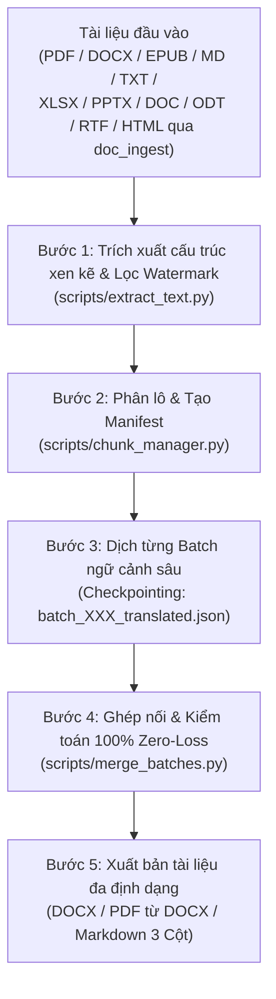

# EJV Trilingual Document Translator (VN - EN - JP)
## Anti-Token Overflow & Zero-Loss Architecture (Gemini 3.8 Multi-Agent)

Kế thừa và nâng cấp từ miniapp **EJV Translator** trong DocStudio, kết hợp sức mạnh xử lý bóc tách tài liệu (PDF, DOCX, TXT, MD) và dịch thuật ngữ cảnh chuyên sâu 3 ngôn ngữ (Tiếng Việt, English, 日本語) với cơ chế **Phân lô & Checkpoint chống tràn token (Zero-Loss Chunking)** và **Quy trình tái tạo cấu trúc chuẩn in ấn (DOCX-First Publication Pipeline)**.

---

> [!CAUTION]
> **NGUYÊN TẮC NỀN TẢNG: CHẠY 100% TRÊN ANTIGRAVITY (ZERO EXTERNAL API)**
> - Skill này chạy hoàn toàn bằng khả năng tích hợp sẵn của Antigravity IDE.
> - TUYỆT ĐỐI KHÔNG gọi REST API bên ngoài (Gemini API, OpenAI API, etc.) hoặc yêu cầu API key.
> - Toàn bộ năng lực dịch thuật là của chính Agent (LLM tích hợp sẵn trong Antigravity).
> - Python scripts chỉ phục vụ: bóc tách dữ liệu, merge, validate, xuất bản file — KHÔNG chứa logic AI.
> - Khi được kích hoạt, skill PHẢI tự chạy liên tục cho đến khi hoàn tất 100% — KHÔNG tự dừng giữa chừng.

---

## 🔧 Path Resolution — Xác định đường dẫn tự động

Agent PHẢI resolve các placeholder trong các lệnh dưới đây:

| Placeholder | Cách xác định |
|-------------|--------------|
| `<skill_dir>` | Thư mục chứa SKILL.md này: `.agents/skills/ejv-translate/` (relative từ workspace root) |
| `<process_dir>` | Thư mục tạm xử lý, đặt tại `_process/<tên_tài_liệu>/` (đã gitignore) hoặc artifact dir |
| `<output_dir>` | **Nơi người dùng chỉ định** hoặc **Mặc định: `~/Downloads/AIWF_Output/`** |
| `<file_dau_vao>` | File PDF/DOCX/TXT do user cung cấp |

> [!IMPORTANT]
> **QUY TẮC BẢO VỆ CODEBASE (Anti-Repo Bloat):**
> - Cho phép người dùng chọn/chỉ định thư mục sẽ lưu file đầu ra.
> - Toàn bộ file thành phẩm xuất bản (`.docx`, `.pdf`, `.md`) PHẢI được lưu vào `<output_dir>` (mặc định: `~/Downloads/AIWF_Output/` hoặc nơi user chỉ định).
> - TUYỆT ĐỐI KHÔNG xuất file thành phẩm vào thư mục gốc của codebase để tránh làm phình dung lượng git repo.

## 📦 Prerequisites — Cài đặt trước khi chạy

Agent PHẢI chạy lệnh này TRƯỚC KHI thực hiện bất kỳ script nào:
```bash
python3 -c "import docx; import fitz; import pdfplumber" 2>/dev/null || pip3 install python-docx pymupdf pdfplumber lxml markitdown pypandoc
```

---

## 🎯 Khi nào sử dụng skill này?


- Dịch tài liệu (PDF có lớp chữ, DOCX/DOC/ODT/RTF, EPUB, PPTX/PPT/ODP, HTML, Text, Markdown) sang **3 ngôn ngữ đồng thời** (VN, EN, JP) hoặc song ngữ bất kỳ.
- Excel (XLSX/XLS/ODS/CSV): dịch **giá trị ô** — mỗi sheet thành một bảng trong bản DOCX/MD đầu ra. KHÔNG giữ công thức, KHÔNG xuất lại tệp Excel (cần giữ bảng tính → nói rõ với người dùng trước khi nhận việc).
- Dịch văn bản dài (10 - 100+ trang như Nghị định, Luật, Hợp đồng, Báo cáo kỹ thuật) mà **không bị cắt xén hay tóm tắt dở dang**.
- Yêu cầu dịch chính xác, bảo toàn 100% cấu trúc phân cấp (tiêu đề h1/h2/h3, đoạn văn p, danh sách ul/ol, bảng biểu table, trích dẫn blockquote, chú thích caption).
- Xuất kết quả ra file hoàn chỉnh: `.docx` chuẩn in ấn, `.pdf` chuyển từ DOCX, `.md` bảng 3 cột đối chiếu song song, hoặc dữ liệu EJV JSON.
- **Không thuộc phạm vi:** giữ nguyên bố cục PDF 1:1 / dịch đè lên trang PDF gốc / tái dựng trang PDF → chuyển sang skill `dich-thuat` (`--mode preserve` hoặc `--mode reconstruct`).

---

## 🧭 Bước 0 — Ngôn ngữ, Glossary & Văn phong (BẮT BUỘC trước khi dịch)

1. **Xác định ngôn ngữ NGUỒN và ngôn ngữ ĐÍCH thực sự được yêu cầu** (ví dụ chỉ `en → vn`). Không mặc định dịch đủ 3
   ngôn ngữ: chỉ dịch và chỉ xuất các ngôn ngữ đích (`--langs vn` hoặc `--langs vn,ja`). Lỗi thật đã gặp: yêu cầu
   Anh → Việt nhưng pipeline xuất thêm `_ja.docx` chứa 99% tiếng Việt.
2. **Đọc lướt toàn văn** (mục lục, 2–3 batch đầu, các bảng) rồi lập `<process_dir>/glossary.json`:
   `{"thuật ngữ nguồn": {"vn": "...", "en": "...", "ja": "..."}}` cho tên riêng, thuật ngữ chuyên ngành, chức danh,
   đơn vị, cụm lặp lại; kèm `<process_dir>/style.md` (xưng hô, văn phong: pháp lý/hành chính/sách phổ thông; cách viết số, ngày).
   Mọi batch phải dùng đúng glossary — dịch cùng một thuật ngữ 2 cách là lỗi.

## 🏗️ Kiến trúc quy trình xử lý 5 Bước (Zero-Loss Protocol)


```mermaid
graph TD
    A["Tài liệu đầu vào<br/>(PDF / DOCX / EPUB / MD / TXT /<br/>XLSX / PPTX / DOC / ODT / RTF / HTML qua doc_ingest)"] --> B["Bước 1: Trích xuất cấu trúc xen kẽ & Lọc Watermark<br/>(scripts/extract_text.py)"]
    B --> C["Bước 2: Phân lô & Tạo Manifest<br/>(scripts/chunk_manager.py)"]
    C --> D["Bước 3: Dịch từng Batch ngữ cảnh sâu<br/>(Checkpointing: batch_XXX_translated.json)"]
    D --> E["Bước 4: Ghép nối & Kiểm toán 100% Zero-Loss<br/>(scripts/merge_batches.py)"]
    E --> F["Bước 5: Xuất bản tài liệu đa định dạng<br/>(DOCX / PDF từ DOCX / Markdown 3 Cột)"]
```

---

## 📋 Hướng dẫn thực hiện chi tiết

### 📌 Bước 1: Trích xuất cấu trúc văn bản (Xen kẽ $y_0$ & Lọc Watermark)

> [!IMPORTANT]
> **Quy tắc bóc tách PDF bất biến:**
> 1. **Thứ tự đọc tự nhiên ($y_0$ Interleaved Extraction):** Phải quét văn bản và bảng biểu đồng thời trên từng trang, sắp xếp theo tọa độ dọc $y_0$ từ trên xuống dưới. Tuyệt đối KHÔNG gộp bảng xuống cuối tài liệu.
> 2. **Lọc sạch Watermark:** Tự động phát hiện và loại bỏ các dòng chữ mờ, chữ xoay chéo (diagonal tracking watermark như `anhnn.qld...`) tránh làm rác nội dung và bảng biểu.
> 3. **Loại trừ vùng trùng lặp:** Text nằm trong vùng bounding box của bảng phải được loại khỏi text thông thường để tránh nhân bản nội dung.

```bash
python <skill_dir>/scripts/extract_text.py --input "<file_dau_vao>" --output "<process_dir>/extracted_blocks.json"
```
Định tuyến theo magic bytes (không theo đuôi tệp): PDF/DOCX/EPUB/MD dùng bộ trích gốc (giữ thứ tự thân văn bản, bảng xen kẽ, ảnh DOCX, bảng EPUB); mọi định dạng khác (XLSX/PPTX/DOC/ODT/RTF/HTML/CSV/TXT mọi bảng mã, ảnh) đi qua `scripts/doc_ingest.py`. Kết quả kèm `<process_dir>/extraction_report.json` (định dạng, tuyến, cảnh báo, trang scan/vỡ dấu).

| Mã thoát | Ý nghĩa | Agent làm gì |
|:---:|---|---|
| 0 | Đã trích | Đọc dòng `⚠️` (trang scan bị bỏ qua, trang vỡ dấu đã trích lại) → báo người dùng trong bàn giao. |
| 3 | PDF scan / ảnh: không có lớp chữ | Dừng. Dùng skill `boc-tach-pdf` (OCR → .md/.docx) rồi dịch tệp kết quả. |
| 2 | PDF mật khẩu, EPUB DRM, Office mã hoá, tệp hỏng/rỗng | Hỏi người dùng đúng điều script in ra (bản không mật khẩu/không DRM). Không đoán mật khẩu. |
| 4 | Thiếu thư viện/LibreOffice | Làm theo lệnh cài đặt script in ra rồi chạy lại. |

Khối `{"type": "image", "src": ...}` (ảnh trong DOCX/PPTX/HTML...) không có chữ để dịch: chép nguyên vào batch dịch (nếu bỏ sót, `merge_batches.py` tự chèn lại đúng vị trí); bộ dựng DOCX/MD chèn ảnh tại chỗ.

### 📌 Bước 2: Phân lô (Chunking) & Thiết lập Manifest
Đối với tài liệu vừa và dài (> 15 khối hoặc > 600 từ), tự động chia thành các batch nhỏ an toàn:
```bash
python <skill_dir>/scripts/chunk_manager.py --input "<process_dir>/extracted_blocks.json" --process-dir "<process_dir>" --max-blocks 15 --max-words 600
```
*Script sẽ tạo `manifest.json` và các file `batch_001_source.json`, `batch_002_source.json`... để quản lý tiến độ từng phần.*

### 📌 Bước 3: Dịch thuật ngữ cảnh sâu từng Batch (Checkpoint Loop)

> [!CAUTION]
> **Bước này PHẢI do chính Agent (LLM) thực hiện — TUYỆT ĐỐI KHÔNG dùng script Python regex/dictionary để "giả dịch".**
> Script Python KHÔNG CÓ khả năng dịch thuật pháp lý chính xác. Nếu agent ghi nguyên bản tiếng Việt vào cột EN/JA thì coi như CHƯA DỊCH.

Agent duyệt tuần tự từng batch (3–5 batches mỗi lượt, tùy độ dài):
1. **Đọc** nội dung `batch_XXX_source.json` (chứa danh sách blocks tiếng Việt gốc).
2. **Dịch thật** từng block sang 3 ngôn ngữ (`vn` giữ nguyên/chuẩn hóa, `en` dịch chính xác, `ja` dịch chính xác) bằng chính khả năng ngôn ngữ của agent.
3. **Ghi kết quả** vào `batch_XXX_translated.json` (JSON array cùng số lượng blocks, cùng cấu trúc type).
4. **Cập nhật manifest**: đánh dấu batch đó là `completed`.
5. Nếu gặp gián đoạn giữa chừng, agent chỉ cần kiểm tra `manifest.json` để tìm các batch `pending` và dịch tiếp.

**Quy tắc dịch thuật bắt buộc:**
- **1 khối nguồn = 1 khối dịch, đúng thứ tự** (không gộp/tách khối: `merge_batches.py` báo lỗi và dừng nếu lệch số khối).
  Giữ nguyên `type` và trường nguồn `text`; chỉ thêm các trường ngôn ngữ ĐÍCH. Bảng: dịch MỌI ô (kể cả ô ghi chú dài,
  ô lặp lại) — lỗi thật đã gặp: 82 ô bảng tiếng Việt còn nguyên tiếng Nhật.
- Trường của ngôn ngữ NGUỒN (ví dụ `vn` khi nguồn là tiếng Việt): giữ nguyên text gốc, chỉ làm sạch ký tự rác/watermark.
- `en`: Dịch sang tiếng Anh chuẩn pháp lý / hành chính quốc tế. Dùng thuật ngữ chuyên ngành (CGMP-ASEAN, PIF, CFS, INCI, Adverse Events...).
- `ja`: Dịch sang tiếng Nhật chuẩn văn phong công vụ (法令文体). Dùng kính ngữ hành chính.
- **Mọi con số, ngày tháng, tên riêng, mã số văn bản**: Giữ nguyên giá trị, chỉ điều chỉnh định dạng theo quy ước từng ngôn ngữ.
- **Cấm**: Tóm tắt, lược bỏ, thay thế bằng placeholder "[...]", hoặc ghi "tương tự như trên".

#### Cấu trúc Block JSON chuẩn (EJV Schema)
```json
[
  {
    "type": "h1",
    "vn": "TIÊU ĐỀ CẤP 1",
    "en": "HEADING LEVEL 1",
    "ja": "見出しレベル1"
  },
  {
    "type": "p",
    "vn": "Nội dung đoạn văn tiếng Việt đầy đủ và chuẩn xác.",
    "en": "Full and accurate English paragraph content.",
    "ja": "完全で正確な日本語の段落内容。"
  },
  {
    "type": "ul",
    "vn": ["Mục 1", "Mục 2"],
    "en": ["Item 1", "Item 2"],
    "ja": ["項目1", "項目2"]
  },
  {
    "type": "table",
    "headers": {
      "vn": ["STT", "Hạng mục", "Kết quả"],
      "en": ["No.", "Item", "Result"],
      "ja": ["項番", "項目", "結果"]
    },
    "rows": {
      "vn": [["1", "Thông số A", "Đạt"], ["2", "Thông số B", "Đạt"]],
      "en": [["1", "Parameter A", "Pass"], ["2", "Parameter B", "Pass"]],
      "ja": [["1", "パラメータA", "合格"], ["2", "パラメータB", "合格"]]
    }
  },
  {
    "type": "meta_table",
    "items": [
      {
        "label": {"vn": "Số lô sản xuất", "en": "Batch Number", "ja": "ロット番号"},
        "value": {"vn": "LOT-2026-001", "en": "LOT-2026-001", "ja": "LOT-2026-001"}
      },
      {
        "label": {"vn": "Ngày sản xuất", "en": "Manufacturing Date", "ja": "製造日"},
        "value": {"vn": "15/03/2026", "en": "March 15, 2026", "ja": "2026年3月15日"}
      }
    ]
  }
]
```

### 📌 Bước 3: Dịch thuật Tam ngữ Tuần tự & Tự động Liên tục (Autonomous Continuous Loop)

> [!IMPORTANT]
> **QUY TẢC TỰ ĐỘNG CHẠY LIÊN TỤC KHÔNG NGẮT QUÃNG (Autonomous Full-Run Protocol):**
> Khi thực hiện dịch thuật tài liệu dài có nhiều batch (ví dụ 10 – 50+ batch), Agent **PHẢI tự động chạy một vòng lặp liên tục (continuous autonomous loop)** dịch tuần tự từ batch 1 cho đến batch cuối cùng mà **KHÔNG ĐƯỢC TỰ Ý DỪNG LẠI** xin phép hay chờ người dùng nhắc "tiếp tục" giữa chừng.
> - Chỉ báo cáo tiến độ bằng log tóm tắt sau khi hoàn thành toàn bộ hoặc khi đạt 100% tài liệu.
> - Agent tự dịch bằng khả năng ngôn ngữ tích hợp sẵn — KHÔNG gọi API bên ngoài.

#### Quy trình dịch (Agentic Loop — dùng chính Agent Antigravity):
Agent duyệt tuần tự từng batch:
1. **Đọc** nội dung `batch_XXX_source.json`
2. **Dịch thật** từng block sang 3 ngôn ngữ bằng chính khả năng ngôn ngữ của Agent
3. **Ghi kết quả** vào `batch_XXX_translated.json`
4. **Tiếp tục ngay** batch kế tiếp cho đến 100% — KHÔNG dừng chờ user

#### Kiểm tra tiến độ & Export sau khi dịch xong:
```bash
python <skill_dir>/scripts/auto_translate.py \
    --process-dir "<process_dir>" \
    --output-dir "<output_dir>" \
    --file-stem "[Ten_Tai_Lieu]" \
    --langs <đích, vd: vn> \
    --auto-export
```
*Script `auto_translate.py` chỉ làm I/O: kiểm tra tiến độ, merge, chạy `translation_qa.py`, rồi export DOCX/PDF/MD
CHỈ cho `--langs`. Từ chối xuất khi còn batch pending hoặc còn lỗi chặn (exit 2). Không chứa logic AI hay API key.*

---

### 📌 Bước 3.5: Tự biên tập (Translate → Edit → Proofread)
Sau mỗi 5 batch: đọc lại bản dịch đối chiếu nguồn ở các khối dài/bảng/khối có số liệu, sửa sai nghĩa, sai thuật ngữ
(so glossary), câu dịch máy cứng (văn phong tiếng Việt tự nhiên, không "—"). Ghi đè lại `batch_XXX_translated.json`.

### 📌 Bước 4: Ghép nối & Kiểm tra toàn vẹn 100% (Zero-Loss Audit)
Ghép toàn bộ các batch đã dịch thành file hoàn chỉnh:
```bash
python <skill_dir>/scripts/merge_batches.py --process-dir "<process_dir>" --output "<process_dir>/merged_ejv.json"
```

**Cổng chặn bản dịch (bắt buộc):**
```bash
python3 <skill_dir>/scripts/translation_qa.py --input "<process_dir>/merged_ejv.json" --langs <đích, vd: vn> --json "<process_dir>/translation_qa.json"
```
Chặn (exit 1): ô THIẾU, CHÉP GỐC (y hệt nguồn), SAI CHỮ (ja không có chữ Nhật, vn/en còn chữ Nhật, vn không dấu),
lệch CẤU TRÚC list/bảng. Cảnh báo: SỐ LIỆU mất, ĐỘ DÀI bất thường (dịch sót/tóm tắt), "—". Sửa đúng các khối được báo
trong batch tương ứng, merge lại, chạy lại tới khi 0 lỗi chặn. `build_docx*.py` cũng tự từ chối xuất khi ngôn ngữ đích còn ô chưa dịch
(trước đây nó lặng lẽ chèn ngôn ngữ khác vào chỗ trống).

---

### 📌 Bước 5: Xuất bản tài liệu đa định dạng (DOCX-First Pipeline)

> [!WARNING]
> **QUY TẮC CẤM SỬA ĐÈ TRỰC TIẾP LÊN PDF (Anti-Redaction Rule):**
> Tuyệt đối KHÔNG dùng cơ chế Redact / Whiteout đè trực tiếp lên PDF gốc. Cơ chế đó sẽ phá hủy đường kẻ bảng, làm tràn chữ, đè chữ lên watermark và tạo kết quả lỗi.
> **Quy trình chuẩn bắt buộc:** Luôn luôn dựng file DOCX hoàn chỉnh $\rightarrow$ Sau đó xuất sang PDF bằng bộ chuyển đổi Multi-Tier.

#### 1. Xuất file Word DOCX từng ngôn ngữ:
```bash
# Tiếng Việt (chuẩn hành chính):
python <skill_dir>/scripts/build_docx.py --input "<process_dir>/merged_ejv.json" --output "<output_dir>/[Ten]_vi.docx" --lang vn --style administrative

# Tiếng Anh (chuẩn quốc tế):
python <skill_dir>/scripts/build_docx.py --input "<process_dir>/merged_ejv.json" --output "<output_dir>/[Ten]_en.docx" --lang en --style standard

# Tiếng Nhật:
python <skill_dir>/scripts/build_docx.py --input "<process_dir>/merged_ejv.json" --output "<output_dir>/[Ten]_ja.docx" --lang ja --style standard
```

#### 2. Xuất Bảng đối chiếu Markdown (Parallel View):
```bash
python <skill_dir>/scripts/build_markdown.py --input "<process_dir>/merged_ejv.json" --output "<output_dir>/[Ten]_tam_ngu_parallel.md" --mode parallel
```

#### 3. Xuất PDF từ DOCX (khi người dùng cần PDF):
```bash
soffice --headless --convert-to pdf --outdir "<output_dir>" "<output_dir>/[Ten]_vi.docx"
```
Không có `soffice` → bàn giao `.docx` (Word / Google Docs / Pages lưu PDF được) và nói rõ với người dùng.

#### 4. Cần giữ nguyên bố cục PDF gốc?
Skill này KHÔNG dịch đè lên trang PDF. Tài liệu cần giữ bố cục 1:1 (con dấu, bằng khen, chuyên khảo 2 cột, biểu đồ) hoặc cần tái dựng trang PDF → chuyển sang skill **`dich-thuat`** (`.agents/skills/dich-thuat/SKILL.md`). Có thể tái sử dụng `merged_ejv.json` và `glossary.json` đã lập ở đây làm bảng thuật ngữ cho skill đó.

---

### 📌 Bước 6: Cổng chặn dịch sót (Zero-Residual Gate)

> [!IMPORTANT]
> Trước khi xuất file, `translation_qa.py` PHẢI trả về **0 lỗi chặn** cho mọi ngôn ngữ đích (THIẾU, CHÉP GỐC, SAI CHỮ, CẤU TRÚC). Còn sót dù chỉ 1 khối chữ nguồn → CHƯA được báo hoàn thành (Luật R3 §8).

```bash
python <skill_dir>/scripts/translation_qa.py --input "<process_dir>/merged_ejv.json" --langs <đích> --source-lang <nguồn> --json "<process_dir>/qa.json"
```

Nếu đã xuất PDF từ DOCX, kiểm tra thêm chữ nguồn còn sót trong PDF bằng engine dùng chung (Luật R7; chỉ đọc mục `untranslated_blocks`, bỏ qua điểm bố cục vì bản DOCX được dàn lại trang):
```bash
python3 .agents/skills/_shared/pdf/verify_retention.py --source "<file_goc>.pdf" --target "<output_dir>/[Ten]_vi.pdf" --json-output "<process_dir>/residual.json"
```

---

## 🖥️ Hệ thống Xuất bản (DOCX-First Publication)

### Cơ chế Xuất bản Tài liệu Mới (DOCX-First Publication):
Áp dụng khi cần tái tạo lại tài liệu thành file Word hoặc PDF theo chuẩn văn bản hành chính Việt Nam (Nghị định 30/2020/NĐ-CP):

| Tầng (Tier) | Công cụ / Engine | Môi trường áp dụng | Đặc điểm |
| :--- | :--- | :--- | :--- |
| **Tier 1 (DOCX-First)** | **LibreOffice (`soffice` headless)** | macOS, Linux, Windows | Độc lập, mã nguồn mở, hỗ trợ CLI mạnh mẽ qua `-env:UserInstallation`, tạo file PDF chuẩn in ấn A4. |
| **Tier 2 (Dự phòng OS)** | **Microsoft Word Automation (`docx2pdf`)** | Windows, macOS có cài MS Word | Sử dụng trực tiếp engine của Microsoft Word qua AppleScript / Windows COM để xuất PDF chuẩn xác. |
| **Tier 3 (Safe Fallback)** | **Pure DOCX Delivery** | Mọi máy tính không cài CLI | Tự động xuất file `.docx` định dạng chuẩn quốc tế (OOXML). Người dùng mở file `.docx` trên Word / Google Docs / Pages và lưu PDF trong 1 giây. |

---

## ⚠️ Quy tắc dịch bất biến (Golden Rules)

1. **Anti-Token Overflow**: Tuyệt đối KHÔNG cố dịch toàn bộ văn bản dài trong một prompt duy nhất. Bắt buộc sử dụng quy trình phân lô `chunk_manager` và checkpoint.
2. **Zero Meaning Loss & Zero Text Skipping**: Không được tóm tắt, không được bỏ qua điều khoản/đoạn văn nào.
3. **Preserve Identifiers & Numbers**: Giữ nguyên mã hiệu văn bản (Nghị định 37/2026/NĐ-CP), số liệu, ngày tháng, tên riêng, URL, thông số kỹ thuật.
4. **Symmetrical Structure**: Cả 3 ngôn ngữ phải có cùng số lượng phần tử mảng trong `ul`, `ol` và cùng số hàng/cột trong `table`.
5. **DOCX-First Architecture**: Mọi tài liệu PDF đầu ra đều phải được sinh từ mô hình cấu trúc DOCX sạch, tuyệt đối không dùng phương pháp chèn đè/redact PDF.

---

## 5. Quality Gate & Giao thức Bàn giao Sạch

### Checklist Kiểm tra Chất lượng (Quality Gate):
1. ✅ 100% các batch dịch đã hoàn thành và gộp thành công qua `merge_batches.py` (không lệch số khối).
2. ✅ `translation_qa.py --langs <đích>` = **0 lỗi chặn**; cảnh báo SỐ LIỆU/ĐỘ DÀI đã được xem từng mục; thuật ngữ khớp `glossary.json`.
2b. ✅ Chỉ xuất file cho ngôn ngữ đích được yêu cầu; mở file DOCX đầu ra kiểm tra 3 đoạn ngẫu nhiên đúng ngôn ngữ.
3. ✅ **Confidence Flagging:** Đối với các thuật ngữ chuyên ngành hẹp hoặc đoạn văn bản gốc mờ nghĩa có độ tin cậy < 85%, gắn cờ ghi chú `[CẦN XÁC MINH: <lý_do>]` thay vì tự suy diễn sai nghĩa.
4. ✅ Khử dấu vết AI: Cấm em dash `—` trong bản dịch tiếng Việt, cấm Oxford comma `, và`, cấm dấu hai chấm cuối tiêu đề.
5. ✅ **Zero-Residual Untranslated Gate (Kiểm tra dịch sạch 100%):** `translation_qa.py` = 0 lỗi chặn; nếu có xuất PDF thì `_shared/pdf/verify_retention.py` báo `untranslated_blocks = 0`. Còn sót chữ nguồn → Agent CẤM báo cáo hoàn thành.
6. ✅ Không hứa giữ bố cục PDF 1:1 trong skill này; yêu cầu đó đã được chuyển sang skill `dich-thuat`.
7. ✅ Toàn bộ file thành phẩm DOCX/PDF/Markdown đã được xuất ra `<output_dir>` (mặc định: `~/Downloads/AIWF_Output/`).
8. ✅ Giao thức Bàn giao Sạch: Khung chat chỉ thông báo tóm tắt số block, số trang, xác nhận 0 residual blocks, điểm bảo tồn retain định dạng và đường dẫn link trỏ đến file kết quả trong `~/Downloads/AIWF_Output/`.

---

## 🧩 Engine dùng chung (Luật R7)

> Năng lực dưới đây đã có trong `.agents/skills/_shared/` hoặc `scripts/` — **gọi lại, KHÔNG viết lại** trong skill. Cần năng lực mới: tra [`_shared/ENGINES.md`](../_shared/ENGINES.md) trước; thiếu thì mở rộng/đăng ký ở `_shared`, rồi chạy `python3 scripts/check_shared_reuse.py`.

| Engine / công cụ | Dùng cho | Cách gọi |
|---|---|---|
| `scripts/doc_ingest.py` | Đọc tệp người dùng (PDF/DOCX/XLSX/PPTX/ảnh…) thành `source.md` + `manifest.json` | `.venv/bin/python scripts/doc_ingest.py "<tệp>" --out ~/Downloads/AIWF_Output/_ingest/<việc> --json` |
| `doc_ingest_bridge` | Gọi doc_ingest từ Python: `run_ingest`, `md_blocks`, `pdf_preflight`, `sniff_kind`… | import trong `scripts/extract_text.py` |
| `pdf.verify_retention` | Cổng dịch sót ký tự nguồn (R3 §8) | `python3 .agents/skills/_shared/pdf/verify_retention.py` |
