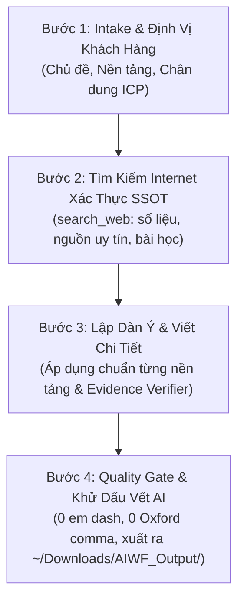

# Viết Bài 2.0 — Zero-Hallucination & Multi-Platform Copywriting
## Hệ Thống Sáng Tạo Nội Dung Chuẩn Chuyển Đổi Cao (Gemini 3.8 Multi-Agent)

Kỹ năng chuyên trách sản xuất nội dung chữ viết độ chính xác cao, kết hợp năng lực tra cứu Internet thời gian thực để tìm kiếm **Nguồn Sự Thật Duy Nhất (SSOT)** và các khung tâm lý học chuyển đổi (AIDA, PAS, BAB).

---

> [!CAUTION]
> **NGUYÊN TẮC NỀN TẢNG: CHẠY 100% TRÊN ANTIGRAVITY (ZERO EXTERNAL API)**
> - Skill này chạy hoàn toàn bằng khả năng tích hợp sẵn của Antigravity IDE (Gemini 3.8) kết hợp công cụ tra cứu `search_web`.
> - TUYỆT ĐỐI KHÔNG gọi REST API bên ngoài (Gemini API, OpenAI API, Claude API) hoặc yêu cầu API key trong code.
> - Toàn bộ năng lực sáng tạo, thẩm định dữ liệu và biên tập văn phong là của chính Agent.
> - Khi được kích hoạt, skill PHẢI tự chạy liên tục (Autonomous Full-Run) từ khâu nghiên cứu đến xuất bản thành phẩm.

---

## 🔧 Path Resolution & Thư mục Lưu trữ Đầu ra

Agent PHẢI xác định đường dẫn lưu file đầu ra trước khi xuất bản:

| Placeholder | Quy ước xác định đường dẫn |
|---|---|
| `<output_dir>` | **Nơi người dùng chỉ định** (ví dụ: đường dẫn do user cung cấp) hoặc **Mặc định: `~/Downloads/AIWF_Output/`** |
| `<process_dir>` | Thư mục tạm xử lý, ưu tiên đặt tại `_process/viet_bai_[chu_de]/` (đã gitignore) |

> [!IMPORTANT]
> **QUY TẮC BẢO VỆ CODEBASE (Anti-Repo Bloat):**
> - Cho phép người dùng chọn/chỉ định thư mục sẽ lưu file bài viết (`.md`, `.docx`, `.html`).
> - Mọi file xuất bản thành phẩm PHẢI được lưu vào `<output_dir>` (mặc định: `~/Downloads/AIWF_Output/` hoặc nơi user chỉ định).
> - TUYỆT ĐỐI KHÔNG lưu file bài viết thành phẩm trực tiếp vào thư mục gốc của codebase nếu người dùng không yêu cầu, để tránh làm tăng dung lượng kho lưu trữ Git.

---

## 🎯 Khi Nào Kích Hoạt Kỹ Năng Này?

Kỹ năng được kích hoạt khi người dùng cần sản xuất nội dung bài viết chất lượng cao:
- **Blog chuẩn SEO:** Cấu trúc bài dài (1.500 - 3.000 từ), phân cấp H1-H2-H3 rõ ràng, tối ưu thẻ meta title, meta description, tích hợp từ khóa tự nhiên, trích dẫn nguồn uy tín.
- **Website / Landing Page Copy:** Khung PAS (Problem - Agitate - Solve), tiêu đề định lượng giá trị, danh sách lợi ích (Benefits over Features), nút kêu gọi hành động (CTA) dứt khoát.
- **Facebook / Social Media Post:** Hook 3 giây đầu giữ chân người đọc, nhịp điệu ngắn gọn, kỹ thuật kể chuyện (Storytelling), biểu tượng emoji tinh tế, kích thích tương tác.
- **Bài PR / Báo chí:** Cấu trúc tháp ngược (Inverted Pyramid), trích dẫn chuẩn mực, thông tin trung thực, khách quan (Honest over Sensational).

---

## 🏗️ Quy Trình 4 Bước Triển Khai (Intake → Fact-Finding → Drafting → Quality Gate)



### 📌 Bước 1: Tiếp Nhận & Phân Loại Intake (Bảng 4 Nền Tảng)
Xác định rõ nền tảng người dùng hướng tới:
1. `blog`: Đọc quy chuẩn tại `standards/platform_guidelines.md` (mục 1).
2. `web`: Đọc quy chuẩn tại `standards/platform_guidelines.md` (mục 2).
3. `facebook`: Đọc quy chuẩn tại `standards/platform_guidelines.md` (mục 3).
4. `pr`: Đọc quy chuẩn tại `standards/platform_guidelines.md` (mục 4).

### 📌 Bước 2: Tìm Kiếm Internet & Lập Source of Truth (Fact-Finding)
* Dùng `search_web` tìm kiếm các tài liệu, báo cáo, số liệu thống kê mới nhất về chủ đề.
* Trích xuất các sự thật khách quan (facts) và lưu vết tại `<process_dir>/facts_evidence.md`.
* **Quy tắc Chống Ảo Giác Số Liệu:** Tuyệt đối cấm bịa đặt các tỷ lệ phần trăm (%), con số tăng trưởng hoặc trích dẫn nhân vật không có thật. Mọi con số phải trích dẫn URL hoặc nguồn uy tín.

### 📌 Bước 3: Soạn Thảo Chi Tiết
* Triển khai dàn ý dựa trên template mẫu trong thư mục `templates/`.
* Áp dụng văn phong đĩnh đạc, góc nhìn thực chiến, câu văn gãy gọn.

### 📌 Bước 4: Kiểm Định Khử Dấu Vết AI (Quality Gate)
* Chạy script kiểm tra văn phong:
  ```bash
  python .agents/skills/viet-bai/scripts/fact_checker.py --input "<process_dir>/draft.md"
  ```
* Xuất file bài viết hoàn thiện vào `<output_dir>/[Tên_Bài_Viết].md`.

---

## 5. Quality Gate & Giao Thức Bàn Giao Sạch

### Checklist Kiểm Tra Chất Lượng (Quality Gate):
1. ✅ **Evidence Verifier:** 100% các số liệu thống kê hoặc tuyên bố khoa học/thị trường đều có nguồn trích dẫn từ kết quả tìm kiếm `search_web` hoặc tài liệu người dùng.
2. ✅ **Confidence Flagging:** Đối với các thông tin thị trường chưa có số liệu chính thức (độ tin cậy < 85%), bắt buộc ghi chú `[CẦN XÁC MINH: Chưa có thống kê công bố chính thức]`, cấm tự đoán số liệu.
3. ✅ **Khử Dấu Vết AI Tiếng Việt (Anti-AI Footprint):**
   - Đếm số gạch ngang dài kiểu tiếng Anh `—` = 0 (thay bằng ` - ` hoặc liên từ).
   - Đếm số dấu phẩy Oxford `, và` = 0 (tiếng Việt chỉ dùng `và`).
   - Đếm dấu hai chấm cuối tiêu đề/heading = 0.
   - Không chứa các từ sáo rỗng (*"Trong kỷ nguyên số...", "Đóng vai trò then chốt...", "Như chúng ta đã biết..."*).
4. ✅ Toàn bộ file thành phẩm bài viết được lưu vào `<output_dir>` (mặc định: `~/Downloads/AIWF_Output/`).
5. ✅ **Giao thức Bàn giao Sạch:** Khung chat chỉ thông báo tóm tắt nội dung bài viết, các điểm nhấn chính, số lượng từ và đường dẫn file kết quả có thể click mở ngay.
