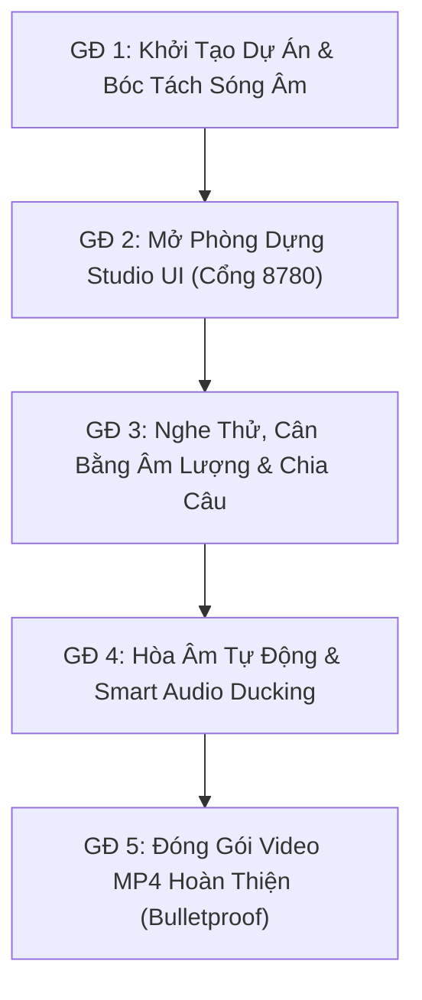

# Workflow W3: Lồng Tiếng Video Chuyên Nghiệp (Studio Dubbing SOP)

> **Mục tiêu:** Hệ thống hóa toàn diện quy trình lồng tiếng và thuyết minh video đa ngôn ngữ (Việt - Nhật - Anh) chuẩn phòng thu, đảm bảo giọng đọc AI cất lên chuẩn xác từng mili-giây đè lên video gốc, tự động hạ nhạc nền (Smart Ducking), hiển thị phụ đề tương tác trực quan 1:1, và đóng gói video thành phẩm MP4 hoàn hảo mà không phụ thuộc vào bất kỳ API trả phí bên ngoài nào.
> **Căn cứ pháp lý & kỹ thuật:** Luật R0 (Git-Sync Mandatory), Luật R1 (Anti-Repo Bloat), Luật R2 (Code Quality), Luật R4 (Skill Standard v1.0), Luật R5 (Legal Claim Compliance).

---

> [!IMPORTANT]
> **QUY TẮC BẢO VỆ CODEBASE (Anti-Repo Bloat):**
> - Mọi video thành phẩm xuất bản (`<tên_video>_dubbed.mp4`) PHẢI được lưu tại `<output_dir>` do người dùng chỉ định hoặc **Mặc định: `~/Downloads/`**.
> - Thư mục trung gian xử lý phải nằm tại `_process/dubbing_[project_id]/` (đã nằm trong `.gitignore`). Tuyệt đối KHÔNG xuất file kết quả vào thư mục gốc repository.

---

## OUTPUT (Khóa trước)
1. **Video MP4 lồng tiếng hoàn chỉnh:** Nằm tại `<output_dir>/<tên_video>_dubbed.mp4` với chất lượng hình ảnh sắc nét gốc, âm thanh hòa âm giọng lồng tiếng AI đè lên tiếng nền đã ducking chuẩn phòng thu.
2. **File Phụ Đề & Kịch Bản Đã Đồng Bộ:** File `subtitles.ass` và `subtitles.srt` lưu tại `<process_dir>` theo kiểu dáng tùy chỉnh (đơn ngữ hoặc song ngữ).
3. **Phòng Dựng Tương Tác Localhost:** Giao diện điều phối trực tiếp tại `http://127.0.0.1:8780` cho phép nghe thử giọng đọc tức thì, tinh chỉnh âm lượng trên loa và re-render liên tục.

---

## INPUT (Truy ngược)
1. **Từ Người dùng:**
   - File video nguồn (`<video_path>`: MP4, MOV, MKV, WebM).
   - Kịch bản / Phụ đề (`<subtitles_path>`: file `.srt` hoặc `project.json` từ kỹ năng `phu-de`).
   - Ngôn ngữ lồng tiếng (`vi`, `ja`, `en` - mặc định: `vi`).
   - Giới tính giọng đọc (`female`, `male` - mặc định: `female`).
   - Thư mục lưu kết quả (`<output_dir>` - mặc định: `~/Downloads/`).
2. **Từ Hệ thống AIWF:**
   - Kỹ năng lồng tiếng: `.agents/skills/long-tieng/`.
   - Động cơ tổng hợp giọng đọc: `voice_synthesizer.py` (hỗ trợ 10 giọng studio 5 sao).
   - Bộ máy đồng bộ hai luồng: `local_dubbing_server.py` & `ui/app.js` (Dual-Track Audio Sync).
   - Bộ máy đóng gói âm thanh: `dubbing_pipeline.py`.

---

## PROCESS (5 GIAI ĐOẠN THỰC THI CHUẨN)



### 🚀 Giai đoạn 1: Khởi Tạo Dự Án & Bóc Tách Sóng Âm
1. Trích xuất âm thanh gốc từ video:
   ```bash
   ffmpeg -y -i "<video_path>" -vn -ac 1 -ar 16000 "<process_dir>/audio_16k.wav"
   ```
2. Khởi tạo file cấu hình dự án `dubbing_project.json`:
   ```bash
   python3 -c "
   import sys; sys.path.insert(0, '.agents/skills/long-tieng/scripts')
   from dubbing_project_manager import create_dubbing_project
   create_dubbing_project('<video_path>', '<subtitles_path>', '<process_dir>')
   "
   ```

---

### 🎛️ Giai đoạn 2: Khởi Chạy Phòng Dựng Studio UI
Khởi chạy Local Bridge Server phục vụ giao diện tại cổng `http://127.0.0.1:8780`:
```bash
python3 .agents/skills/long-tieng/scripts/local_dubbing_server.py --project "<process_dir>/dubbing_project.json"
```
Hệ thống kích hoạt 3 động cơ tương tác:
- **Dual-Track Realtime Audio Sync**: Video Player tự động phát đồng bộ video gốc (đã hạ nhỏ âm lượng nền) cùng luồng âm thanh lồng tiếng `/audio/speech` cất lên đè lên tiếng gốc.
- **Live Subtitle Overlay 1:1**: Phụ đề nổi hiển thị trực tiếp trên video mô phỏng chính xác các thông số kiểu dáng ASS (phông chữ, cỡ chữ, màu sắc, viền, độ mờ nền hộp, lề dưới).
- **Instant Voice Preview**: Nghe thử ngay lập tức câu chào mẫu của từng giọng đọc khi bấm `🔊 Nghe thử`.

---

### ✂ Giai đoạn 3: Tinh Chỉnh Âm Lượng, Kiểu Chữ & Chia Câu
1. **Cân bằng âm lượng (Audio Mixer)**:
   - Kéo thanh trượt `Âm lượng giọng gốc` (0% - 150%) để chỉnh to/nhỏ tiếng gốc ngay trên loa.
   - Kéo thanh trượt `Âm lượng giọng lồng tiếng` (50% - 200%) để giọng đọc AI nổi rõ.
2. **Chia câu tại vị trí phát (`✂ Chia câu tại đây`)**:
   - Khi phát hiện phân đoạn gốc quá dài khiến câu dịch tiếng Việt đọc xong nhưng tiếng gốc vẫn nói, người dùng tua video tới khoảng nghỉ giữa câu và bấm nút chia câu để tách thành 2 câu độc lập.
3. **Tùy biến phụ đề**:
   - Chọn Preset phù hợp: *Hiện đại dưới đáy*, *Hộp mờ TikTok*, *Rạp phim cổ điển*, *Băng rôn phía trên*.
   - Thiết lập chế độ Đơn ngữ hoặc Song ngữ (Việt - Nhật / Việt - Anh).

---

### 📉 Giai đoạn 4: Hòa Âm Tự Động & Smart Audio Ducking
1. Tổng hợp giọng đọc từng câu và co giãn thời lượng qua bộ lọc `atempo`:
   $$\text{speed\_factor} = \frac{\text{duration\_thực\_tế}}{\text{duration\_mục\_tiêu}} \in [0.75, 1.35]$$
2. Ghép nối thành master speech track khớp từng mili-giây bằng `adelay`.
3. Hòa trộn nhạc nền và giọng lồng tiếng bằng cơ chế **Smart Ducking** (`sidechaincompress`):
   - Khi giọng thuyết minh cất lên: Nhạc nền tự động hạ xuống mức 10% - 20%.
   - Khi dứt lời: Nhạc nền tự động trở về mức âm lượng bình thường mượt mà.

---

### 📦 Giai đoạn 5: Đóng Gói Video MP4 Hoàn Thiện (Bulletproof)
- Tự động kiểm tra khả năng của FFmpeg runtime:
  - Nếu có filter `ass` / `subtitles`: Khắc phụ đề cứng lên video.
  - Nếu thiếu filter `ass`: Tự động fallback sang chế độ **Muxing Siêu Tốc (`-c:v copy`)** ghép 100% âm thanh hòa âm `final_mixed_audio.wav` vào video và nhúng phụ đề mềm `mov_text`.
- Xuất video hoàn chỉnh vào `<output_dir>/<tên_video>_dubbed.mp4` (mặc định: `~/Downloads/`).

---

## CHECKLIST NGHIỆM THU (QUALITY GATE)
- [ ] 1. Video thành phẩm tồn tại trong `~/Downloads/` và phát bình thường.
- [ ] 2. Giọng lồng tiếng tiếng Việt phát to rõ, không bị rè méo hay đè chồng chéo lên nhau.
- [ ] 3. Nhạc nền tự động giảm âm lượng mượt mà khi có lời thoại (Smart Ducking) và tăng lại khi hết câu.
- [ ] 4. Mốc thời gian của từng câu lồng tiếng khớp với nhịp xuất hiện của phụ đề và cử chỉ nhân vật.
- [ ] 5. Không vi phạm các từ ngữ cấm theo Luật R5 (chống over-claim).
- [ ] 6. Đạt điểm số kiểm định **100/100đ** qua lệnh `python3 scripts/audit_skill.py --certify long-tieng`.
