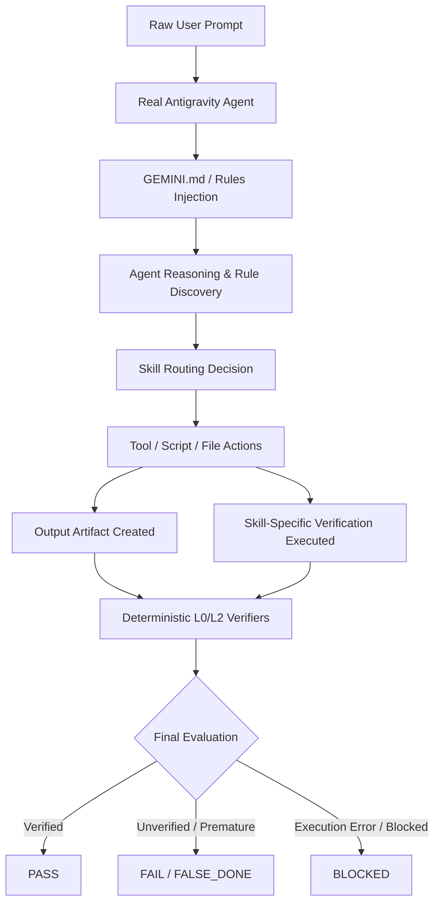

# AIWF AGENT EVALUATION ARCHITECTURE & HARNESS DESIGN

> **Document Version:** 1.0 (Phase 3A Design Specification)  
> **Target Baseline Commit:** `d820d8d`  
> **Status:** Approved Design Specification  
> **Prerequisite:** [`ANTIGRAVITY_AGENT_EVAL_CAPABILITIES.md`](file:///Users/tranhaibang/.gemini/antigravity-ide/scratch/ai-workforce/docs/harness/ANTIGRAVITY_AGENT_EVAL_CAPABILITIES.md)

---

## 1. Core Purpose & Operating Philosophy

The purpose of the AIWF Agent Evaluation Harness is to evaluate the **REAL behavior of an Antigravity Agent** when prompted with raw user requests, completely eliminating mock simulations and ungrounded claims.

### The First Principle: No Simulation
```
The benchmark must test the Agent.
The benchmark must not become the Agent.
Prefer REAL + PARTIALLY MANUAL over AUTOMATED + SIMULATED.
```

A benchmark runner must **NEVER**:
1. Assign `actual_skill = expected_skill` by fiat.
2. Declare routing a `MATCH` unless the Agent was actually observed opening the skill or running its scripts.
3. Infer that a verification step occurred merely because it is written in `SKILL.md`.
4. Infer `PASS` merely because an artifact file exists on disk.
5. Simulate the agent loop in Python with external API calls.

---

## 2. The Target Evaluation Flow

The real execution pipeline to be observed:



The evaluation harness operates as an **independent observer** positioned outside this pipeline. It watches what the Agent actually did, reads the runtime artifacts, and applies deterministic checks.

---

## 3. The Three Evaluation Layers

To maintain rigorous separation of concerns, evaluations are structured into three distinct layers:

```
┌─────────────────────────────────────────────────────────────┐
│ L2 — OUTPUT ARTIFACT QUALITY (Deterministic + Visual)       │
│ • Layout fidelity, PDF geometry, live spreadsheet formulas  │
│ • Zero-residual foreign text, legal claim compliance (R5)   │
├─────────────────────────────────────────────────────────────┤
│ L1 — AGENT HARNESS BEHAVIOR (Observed Runtime Evidence)     │
│ • Skill routing evidence (SKILL.md read or script executed) │
│ • Tool sequence, verifiers executed, blocker respect        │
│ • Absence of False Done (claiming completion without work)  │
├─────────────────────────────────────────────────────────────┤
│ L0 — DETERMINISTIC INFRASTRUCTURE (Scripts & Unit Tests)    │
│ • claim_guard, audit_skill, verify_retention, py/sh scripts │
│ • Schema validation, file integrity, typecheck, lint        │
└─────────────────────────────────────────────────────────────┘
```

### Layer L0: Deterministic Infrastructure
- **What it tests:** The underlying scripts, verifiers, templates, schemas, and file converters.
- **How it runs:** Standard pytest / shell automation.
- **Role in AIWF:** This is the regression bedrock (Phase 2.5 baseline). It ensures that all tool scripts run deterministically and correctly when given valid inputs.

### Layer L1: Agent Harness Behavior
- **What it tests:** The cognitive execution and compliance of the real Antigravity Agent:
  - Did the Agent read the raw user request and understand the intent?
  - Did it navigate to and read the correct `.agents/skills/<skill>/SKILL.md`?
  - Did it call the required tools in the proper sequence?
  - Did it run the mandatory verification scripts before claiming completion?
  - Did it respect error blockers (e.g. claim violations, missing dependencies)?
  - Did it avoid premature "Done" claims?
- **How it runs:** By parsing the native `transcript.jsonl` produced by Antigravity during the execution.

### Layer L2: Output Quality
- **What it tests:** The final deliverable created by the Agent (DOCX, PDF, XLSX, HTML, React app, Markdown).
- **How it runs:** Deterministic verifier scripts (`claim_guard.py` for R5 compliance, `verify_retention.py` for translation completeness, spreadsheet formula inspection, build checks).
- **Rule:** L2 never trusts the Agent's self-assessment; it always runs independent verification on the physical artifact.

---

## 4. Evaluation Mode Selection

Based on the findings in [`ANTIGRAVITY_AGENT_EVAL_CAPABILITIES.md`](file:///Users/tranhaibang/.gemini/antigravity-ide/scratch/ai-workforce/docs/harness/ANTIGRAVITY_AGENT_EVAL_CAPABILITIES.md), we formally evaluate the three possible modes:

### Mode A: Fully Automated Agent Eval
- **Description:** A script spawns a new Antigravity session, submits the prompt, waits for completion, collects telemetry, and scores results with zero human intervention.
- **Feasibility:** **PARTIALLY FEASIBLE (CLI only).**
  - Works via Antigravity CLI: `agy -p "<prompt>" --output-format json --dangerously-skip-permissions`.
  - **Fails** via Antigravity IDE companion (`agentapi new-conversation` returns RPC error `project_id is required`).
- **Limitation:** Does not test the interactive Antigravity IDE GUI environment where human developers work.

### Mode B: Semi-Automated Agent Eval (**RECOMMENDED & SELECTED**)
- **Description:**
  - **Step 1 (Trigger):** The evaluation task is submitted either:
    - *Path B1 (Interactive IDE):* The human tester pastes a standardized raw prompt from the benchmark prompt pack into Antigravity IDE chat.
    - *Path B2 (Automated CLI):* A test runner triggers `agy -p "<prompt>" --output-format json --dangerously-skip-permissions`.
  - **Step 2 (Execution):** The real Antigravity Agent runs autonomously against the workspace.
  - **Step 3 (Automated Ingestion):** Once the Agent completes, an evaluation script points to the conversation's `transcript.jsonl` (found at `~/.gemini/antigravity-ide/brain/<id>/...` or `~/.gemini/antigravity-cli/brain/<id>/...`).
  - **Step 4 (Automated Scoring):** The script extracts observed L1 behaviors, runs L0/L2 deterministic verifiers on the output artifact, and outputs a certified `Agent Run Record`.
- **Why Mode B is Superior:**
  - **Zero simulation.** The agent is 100% genuine.
  - **Covers both environments:** Supports both human interactive IDE workflows and automated CLI runs without changing the evaluation logic.
  - **Strictly evidence-backed:** All L1 metrics are extracted directly from Antigravity's native `transcript.jsonl`.

### Mode C: Reproducible Manual Eval
- **Description:** Human submits prompt, manually inspects IDE steps, manually runs verifier scripts, and manually writes the scorecard.
- **Feasibility:** 100% feasible, but labor-intensive and prone to human transcription errors.
- **Role:** Fallback protocol if transcript access is unavailable.

---

## 5. Specification of the Agent Run Record

Every evaluated agent run must produce a standardized, lightweight machine-readable record. 

When runtime evidence is missing, the value must be explicitly recorded as `null` or `"UNKNOWN"` — **never fabricated or estimated**.

```json
{
  "$schema": "https://raw.githubusercontent.com/bangluutru/ai-workforce/main/schemas/agent_run_record.schema.json",
  "run_id": "run-20260926-t11-001",
  "task_id": "T11",
  "timestamp": "2026-09-26T13:30:00Z",
  "environment": {
    "interface": "antigravity_cli",
    "interface_version": "1.2.11",
    "git_commit": "d820d8d",
    "branch": "main",
    "conversation_id": "87fc91e2-1faf-49b2-b1d2-f13d54c9bb54",
    "transcript_path": "/Users/tranhaibang/.gemini/antigravity-cli/brain/87fc91e2.../transcript.jsonl"
  },
  "input": {
    "raw_prompt": "Thiết kế 1 tờ rơi (leaflet) A4 gấp 3 giới thiệu dịch vụ kế toán thuế trọn gói cho doanh nghiệp SME...",
    "model": "gemini-3.8-flash-high",
    "model_source": "CLI_FLAG | TRANSCRIPT_SETTINGS | HUMAN_ATTESTATION"
  },
  "expected": {
    "skill": "thiet-ke",
    "required_rules": ["R5-legal-claim-compliance.md"],
    "required_verifiers": ["scripts/claim_guard.py"],
    "expected_artifacts": ["*.html", "*.pdf"]
  },
  "observed": {
    "skill_intake": {
      "skill_read": "thiet-ke",
      "evidence_file": ".agents/skills/thiet-ke/SKILL.md",
      "step_index": 3
    },
    "rules_explicitly_read": [
      ".agents/rules/R5-legal-claim-compliance.md"
    ],
    "tools_called": [
      "view_file",
      "run_command",
      "write_to_file"
    ],
    "commands_run": [
      "python3 scripts/claim_guard.py --input /Users/tranhaibang/Downloads/leaflet_thiet_ke.html"
    ],
    "files_read": [
      ".agents/skills/thiet-ke/SKILL.md",
      "GEMINI.md"
    ],
    "files_modified": [],
    "artifacts_created": [
      "/Users/tranhaibang/Downloads/leaflet_thiet_ke.html"
    ],
    "verifiers_executed_by_agent": [
      {
        "verifier": "claim_guard.py",
        "exit_code": 0,
        "step_index": 12
      }
    ]
  },
  "output": {
    "final_response": "Đã hoàn thành thiết kế tờ rơi A4 gấp 3 chuẩn in ấn và kiểm định claim guard...",
    "artifact_paths": [
      "/Users/tranhaibang/Downloads/leaflet_thiet_ke.html"
    ]
  },
  "metrics": {
    "elapsed_seconds": 45.2,
    "total_turns": 4,
    "token_usage": {
      "input_tokens": 84894,
      "output_tokens": 1240,
      "thinking_tokens": 620,
      "cache_read_tokens": 36765,
      "total_tokens": 86134
    },
    "retry_count": 0
  },
  "evaluation": {
    "layer_l0_infrastructure": "PASS",
    "layer_l1_agent_behavior": {
      "skill_routing": "PASS",
      "workflow_compliance": "PASS",
      "verification_execution": "PASS",
      "false_done_detected": false
    },
    "layer_l2_artifact_quality": {
      "claim_guard_status": "PASS",
      "format_validation": "PASS",
      "visual_check": "PASS"
    },
    "overall_status": "PASS"
  }
}
```

---

## 6. Observability Decision Rules

### Rule 1: Skill Routing Evaluation
- If `observed.skill_intake.skill_read == expected.skill` $\rightarrow$ `routing = PASS`.
- If `observed.skill_intake.skill_read != expected.skill` (and not null) $\rightarrow$ `routing = FAIL`.
- If `observed.skill_intake.skill_read == null` $\rightarrow$ `routing = UNKNOWN` (even if the artifact was produced).

### Rule 2: False Done Detection
A run is flagged as `false_done_detected = true` if:
1. The Agent returns a final completion message stating the task is finished, **BUT**:
   - The required artifact was not written to disk, OR
   - The required verifier (e.g. `claim_guard.py`, `verify_retention.py`) was specified as mandatory in `SKILL.md` but was never executed in any `run_command` step, OR
   - The verifier returned exit code 1 (failure) and the Agent claimed success without fixing the issue.
2. If `false_done_detected = true`, `overall_status` is forced to **`FAIL`**.

### Rule 3: Missing Telemetry Handling
- In IDE mode, `token_usage` must be set to `null`. It must NEVER be estimated from character lengths.
- If the model name is not detected in `transcript.jsonl` or CLI args, it must be recorded as `"UNKNOWN"` unless attested by human in the prompt pack metadata.

---

## 7. Scope & Roadmap for Phase 3B

Phase 3A is strictly an audit and design phase. **No implementation code is committed in Phase 3A.**

The smallest valid implementation for **Phase 3B** consists of:
1. **Benchmark Prompt Pack (`tests/agent_eval/prompts/`):**
   - 12 standardized raw prompts corresponding to benchmark cases T01–T12.
   - Each prompt contains metadata (`expected_skill`, `expected_verifiers`, `expected_artifacts`).
2. **Transcript Evaluator Script (`scripts/eval_transcript.py`):**
   - A single, self-contained Python script (~200 lines).
   - Reads a specified `transcript.jsonl` and target artifact path.
   - Extracts observed tools, file reads, commands, and verifiers.
   - Runs L2 deterministic checks on the artifact (`claim_guard`, `verify_retention`).
   - Emits the standardized `Agent Run Record` JSON to `tests/agent_eval/results/`.
3. **Zero Orchestrator Complexity:**
   - No Planner / Reviewer / Verifier agents.
   - No external API keys.
   - No mock harness.
   - Native Antigravity runs the task; `eval_transcript.py` verifies the evidence.
