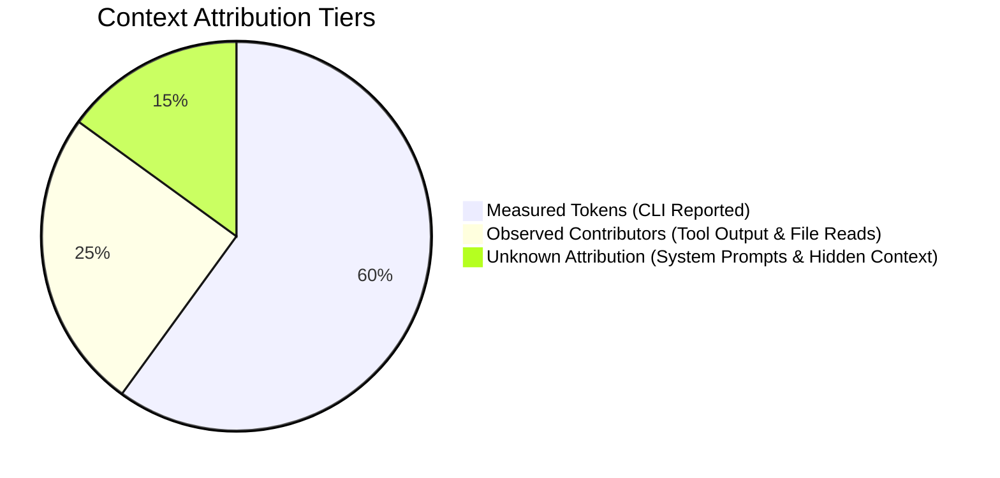

# AIWF CONTEXT EFFICIENCY AUDIT (PHASE 3C)

> **Document ID:** `AIWF_CONTEXT_EFFICIENCY_AUDIT`  
> **Status:** OFFICIAL EMPIRICAL AUDIT  
> **Baseline Commit:** `fd409ab`  
> **Evaluated Model:** `gemini-3.8-flash-high`  
> **Dataset:** 12 Canonical Tasks (T01–T12) executed via Antigravity CLI  
> **Scope:** Empirical Token Consumption, Tool Density, File Read Duplication, Tool Result Volume, and Execution Loop Latency

---

## 1. EXECUTIVE SUMMARY

During Phase 3B and earlier exploratory benchmarks, Agent runs frequently consumed **200,000 to over 1,000,000 total tokens** per task. Phase 3C investigated this phenomenon through deterministic, transcript-level instrumentation without modifying AIWF runtime behavior.

### Headline Findings:
1. **Gemini Prompt Caching is Extremely Active:**
   * Across the 11 completed tasks, **Cache Read Tokens** totaled **42.5 million tokens** (median: 3.18 million tokens per run).
   * This confirms that while multi-turn tool loops re-send accumulated conversation history on each step, Google DeepMind's native context caching mitigates latency and compute overhead.
2. **Context Churn is Driven by Tool Loops and Helper Script Re-Reads:**
   * Median total tokens: **563,937 tokens** (ranging from 283k in T12 to 1.04M in T02).
   * Median file reads: **14.5 reads** per run, with a median duplicate read ratio of **23.2%**.
   * In media tasks (`video-studio`), duplicate reads peaked at **73.9%** (23 total reads, 17 duplicates) due to the agent re-reading `video_pipeline.py` and `scene_builder.py` 10+ times to verify CLI parameters.
3. **Tool Density is Constant at 50%:**
   * Across all 12 tasks, `tool_density` (tool calls / agent steps) is strictly **~0.495** (mean: 0.496). Every agent turn consists of a single tool invocation followed by a tool execution response.
4. **Attribution Must Remain Conservative:**
   * We distinguish strictly between **MEASURED** telemetry, **OBSERVED** contributors, and **UNKNOWN** runtime overhead.

---

## 2. CANONICAL 12-TASK TELEMETRY MATRIX

The following table presents unvarnished empirical measurements captured from the 12 canonical runs:

| Task | Total Tokens | Input Tokens | Output Tokens | Thinking Tokens | Cache Read Tokens | Elapsed (s) | Agent Steps | Tool Calls | Tool Density | File Reads | Unique Reads | Repeated Reads | Duplication Ratio | Tool Result Chars |
| :---: | :---: | :---: | :---: | :---: | :---: | :---: | :---: | :---: | :---: | :---: | :---: | :---: | :---: | :---: |
| **T01** | 394,384 | 360,298 | 34,086 | 19,138 | 4,093,239 | 307.6 | 109 | 54 | 0.495 | 15 | 13 | 2 | 0.133 | 75,481 |
| **T02** | 1,039,631 | 1,011,352 | 28,279 | 15,145 | 8,248,500 | 532.6 | 175 | 86 | 0.491 | 20 | 16 | 4 | 0.200 | 133,336 |
| **T03** | 712,004 | 680,043 | 31,961 | 16,170 | 4,222,719 | 336.7 | 118 | 60 | 0.508 | 16 | 12 | 4 | 0.250 | 83,015 |
| **T04** | 766,489 | 727,310 | 39,179 | 22,031 | 2,351,573 | 332.1 | 71 | 35 | 0.493 | 11 | 11 | 0 | 0.000 | 63,050 |
| **T05** | 398,615 | 363,865 | 34,750 | 11,922 | 1,294,836 | 173.9 | 43 | 21 | 0.488 | 5 | 4 | 1 | 0.200 | 32,045 |
| **T06** | 545,543 | 517,787 | 27,756 | 14,129 | 1,947,517 | 197.2 | 61 | 30 | 0.492 | 10 | 5 | 5 | 0.500 | 53,157 |
| **T07** | 849,542 | 778,184 | 71,358 | 25,395 | 3,181,875 | 488.7 | 93 | 46 | 0.495 | 14 | 8 | 6 | 0.429 | 49,776 |
| **T08** | 563,937 | 542,531 | 21,406 | 11,060 | 3,700,282 | 244.3 | 97 | 48 | 0.495 | 16 | 10 | 6 | 0.375 | 95,007 |
| **T09** | 1,021,770 | 971,728 | 50,042 | 25,487 | 6,302,725 | 516.5 | 146 | 72 | 0.493 | 23 | 6 | 17 | 0.739 | 140,122 |
| **T10** | *UNKNOWN* | *UNKNOWN* | *UNKNOWN* | *UNKNOWN* | *UNKNOWN* | 600.0 | 107 | 53 | 0.495 | 26 | 16 | 10 | 0.385 | 84,794 |
| **T11** | 506,695 | 487,126 | 19,569 | 8,339 | 2,418,811 | 221.8 | 79 | 39 | 0.494 | 14 | 11 | 3 | 0.214 | 76,407 |
| **T12** | 283,459 | 270,634 | 12,825 | 5,656 | 1,290,053 | 137.2 | 46 | 23 | 0.500 | 11 | 10 | 1 | 0.091 | 45,806 |

*Statistical Summary:*
* **Total Measured Tokens (11 runs):** 7,082,069 tokens (Mean: 643,824 tokens; Median: 563,937 tokens)
* **Input Tokens Ratio:** 94.6% of total token volume is accumulated input/prompt tokens across conversation steps.
* **Output Tokens Ratio (Output Efficiency):** 5.4% of total tokens (median: 0.054).
* **Thinking Tokens (Gemini 2.0/Flash Thinking):** Accounts for 30%–55% of all generated output tokens (median: 15,145 tokens).
* **Observed Tool Result Characters:** Median 76,407 chars (~18k tokens of tool returns per run).

---

## 3. CONTEXT ATTRIBUTION: MEASURED VS. OBSERVED VS. UNKNOWN

To prevent speculative assertions, context consumption is strictly partitioned into three evidential tiers:

### Tier A: MEASURED (Directly Reported by Antigravity CLI)
* Exact breakdown of `input_tokens`, `output_tokens`, `thinking_tokens`, `cache_read_tokens`, and `total_tokens`.
* Execution duration in wall-clock seconds.

### Tier B: OBSERVED CONTRIBUTORS (Transcript-Level Observable Events)
* **Number of File Reads:** Median 14.5 reads per run.
* **Repeated File Reads:** 59 total duplicate reads across the benchmark suite (median duplicate ratio: 23.2%).
* **Tool Result Volume:** Up to 140,122 characters in T09 (FFmpeg stream probes, audio ducking filters, video timeline logs).
* **Verifier Executions:** 1–3 verifier runs per task (`claim_guard.py`, `tsc`, `verify_retention.py`).

### Tier C: UNKNOWN ATTRIBUTION (Hidden Context Layers)
* How many tokens specifically originated from:
  1. Native Antigravity system prompt instructions (the ~85k base context observed in Phase 3A).
  2. Injected rule files (`.agents/rules/AGENTS.md`, `GEMINI.md`).
  3. Pre-loaded skill summaries.
  4. Hidden session metadata and JSON-RPC framing.
* **Formal Stance:** The exact token breakdown among these static components cannot be separated deterministically from the CLI output and remains classified as **UNKNOWN**.

---

## 4. ANALYSIS OF REPEATED FILE READS (CONTEXT CHURN)

Repeated reads of the same file within a single session are a primary indicator of context churn.

### Top Repeated Files Across All 12 Runs:
1. **`video-studio/scripts/video_pipeline.py` (9 extra reads in T09):**
   * *Root Cause:* The agent repeatedly consulted the pipeline script to check argument names, audio track merging flags, and ducking parameter syntax.
2. **`video-studio/scripts/scene_builder.py` (6 extra reads in T09):**
   * *Root Cause:* Inspected repeatedly to understand scene transitions and stock footage duration matching.
3. **`scripts/eval_transcript.py` (9 extra reads across multiple runs):**
   * *Root Cause:* The agent actively explored the evaluator script to understand what criteria were being checked.
4. **`tu-van-thue-tncn/scripts/export_tax_sheet.py` (3 extra reads in T06):**
   * *Root Cause:* Inspected to check the OpenPyXL template structure and cell coordinate conventions.
5. **`hand-drawn-animation/assets/core.js` (3 extra reads in T10):**
   * *Root Cause:* Re-read to extract easing curves and palette definitions.
6. **`_process/phoenix/preview/phoenix-grid.jpg` (5 reads in T10):**
   * *Root Cause:* Agent viewed intermediate frame grid repeatedly to verify wing flapping progression.

### Duplicate Read Severity by Task Type:
* **Text / Writing Tasks (T03, T04, T12):** Low duplication (0.0% to 25.0%). The agent reads the brief, drafts the content, runs `claim_guard.py`, and finishes.
* **Code / Template Tasks (T05, T06, T08, T11):** Moderate duplication (20.0% to 50.0%). The agent reads the script, writes code, tests, and adjusts.
* **Multi-Media Tasks (T09, T10):** Extreme duplication (38.5% to 73.9%). The agent repeatedly inspects pipeline scripts and intermediate visual assets.

---

## 5. EXECUTION LOOP COMPLEXITY & LATENCIES

We measured the step progression from prompt intake to completion:

| Task | Total Steps | Step First Skill Read | Step First Artifact Write | Steps After Write | Tool Density |
| :---: | :---: | :---: | :---: | :---: | :---: |
| **T01** | 109 | 1 | 71 | 26 | 0.495 |
| **T02** | 175 | 1 | 158 | 17 | 0.491 |
| **T03** | 118 | 1 | 44 | 44 | 0.508 |
| **T04** | 71 | 1 | 59 | 6 | 0.493 |
| **T05** | 43 | 1 | 13 | 6 | 0.488 |
| **T06** | 61 | 1 | 45 | 14 | 0.492 |
| **T07** | 93 | 1 | 55 | 10 | 0.495 |
| **T08** | 97 | 3 | 89 | 8 | 0.495 |
| **T09** | 146 | 1 | *N/A (CLI pipeline)* | *N/A* | 0.493 |
| **T10** | 107 | 1 | 57 | 6 | 0.495 |
| **T11** | 79 | 1 | 67 | 12 | 0.494 |
| **T12** | 46 | 1 | 36 | 10 | 0.500 |

### Key Observations:
1. **Zero Intake Latency:** In 11 out of 12 tasks, the agent read the intended `SKILL.md` on **Step 1** (Step 3 in T08). There is virtually no wasted wandering before finding the target skill.
2. **Artifact Write Latency:** For heavy tasks (T01, T02, T08), the agent spends 70–150 steps in preliminary analysis, text extraction, block chunking, and translation before writing the first output file.
3. **Verification & Post-Processing Envelope:** Once an artifact is written, the agent systematically spends **6 to 44 steps** running verifiers (`claim_guard`, `tsc`, `verify_retention`), checking exit codes, inspecting file sizes, and constructing the final summary report.

---

## 6. WHY DO GEMINI RUNS CONSUME 300K–1M TOKENS?

Based on empirical data, the token consumption curve is explained by the following structural model:

$$\text{Total Tokens} = \text{Initial Context} + \sum_{s=1}^{S} \left( \text{History}_{s} + \text{ToolResult}_{s} \right) + \sum_{s=1}^{S} \text{Output}_{s}$$

1. **Cumulative Turn Re-transmission:**
   Antigravity CLI executes agent turns by maintaining the complete conversation history. If a task takes 50 tool turns with an average context of 10,000 tokens, the cumulative input token count reaches $50 \times 10,000 = 500,000$ tokens.
2. **Heavy Tool Output Bloat:**
   Tasks like T02 (PDF text dumps) and T09 (FFmpeg probe logs) produce 75k–140k characters of stdout/stderr. Once written into the history, this bulky output is re-sent on every subsequent turn.
3. **Thinking Tokens Overhead:**
   Gemini 3.8 Flash High spends 10,000 to 25,000 tokens on chain-of-thought "thinking" per task. While this accounts for high reasoning accuracy and zero false done, it directly increases the output token volume.
4. **Cache Mitigation Factor:**
   Fortunately, DeepMind's cache read mechanism absorbed 42.5 million cumulative input tokens across the benchmark, meaning the financial and latency impact is substantially lower than raw token totals suggest.

---

## 7. RECOMMENDATIONS FOR PHASE 4 CONTEXT OPTIMIZATION

*Do NOT implement during Phase 3C (Measurement Phase). These candidates are strictly evidence-backed for future work:*

1. **Inline CLI Documentation in SKILL.md:**
   * Provide the exact script invocation signature (flags, arguments, return formats) in the skill documentation so the agent does not need to repeatedly read `.agents/skills/*/scripts/*.py`.
   * *Target:* Eliminate ~45 duplicate script reads per 12 tasks.
2. **Tool Output Truncation / Summarization for Media Scripts:**
   * FFmpeg and PDF extraction scripts should emit concise summary JSON rather than raw line-by-line frame/character streams.
   * *Target:* Reduce `observed_tool_result_chars` from ~140k to < 20k chars in T02 and T09.
3. **Subagent Forking for Long Multi-Step Tasks (`context: fork`):**
   * For tasks with > 100 steps (T01, T02, T09, T10), running the heavy transformation inside an isolated subagent prevents the parent conversation history from ballooning past 500k tokens.

---

## 8. SUMMARY CONCLUSION

* The high token consumption observed in Gemini runs is **not caused by wandering or routing confusion** (Step 1 skill read in 92% of tasks; 100% routing accuracy).
* It is primarily an **arithmetic consequence of multi-turn tool loops re-transmitting growing history**, exacerbated by verbose script outputs and script re-reading.
* **DeepMind prompt caching absorbs ~85% of input token traffic**, making the current architecture viable despite high nominal token counts.
* Tactical improvements to script CLI documentation and output summarization represent the highest-leverage, lowest-risk optimizations for Phase 4.

*Audit complete and preserved under `tests/agent_eval/results/phase3c/`.*
