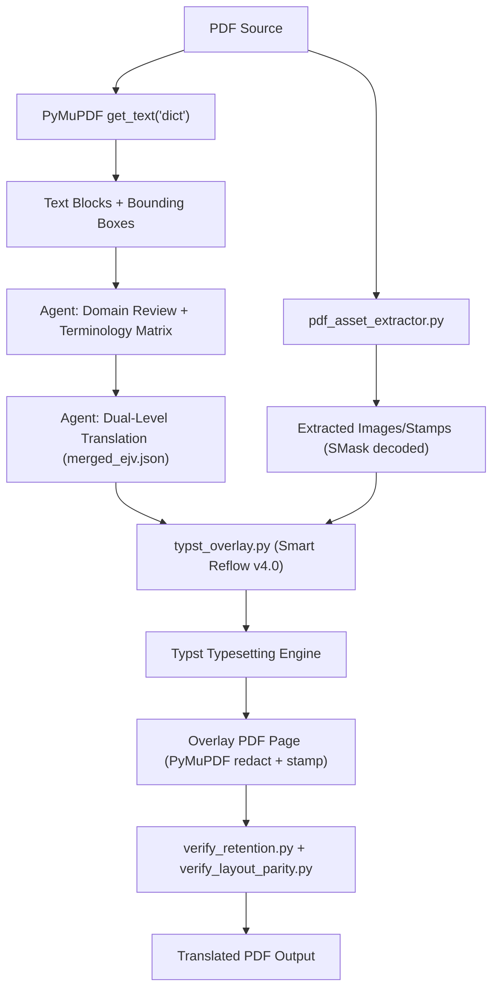

# TRANSLATION FORMAT-PRESERVING BASELINE

**Skill:** `dich-giu-dinh-dang` v2.0
**Date:** 2026-09-26
**Auditor:** AIWF Skill Quality Track #1
**Baseline commit:** (to be set at commit time)

---

## 1. Current Architecture

### 1.1 Architecture Overview

### 1.2 Core Components (OBSERVED)

| Component | File | Size | Purpose |
|---|---|---|---|
| **SKILL.md** | `SKILL.md` | 19KB | 7-stage workflow, R6 7-pillar compliance |
| **Asset Extractor** | `scripts/pdf_asset_extractor.py` | 6KB | SMask decoding, image extraction, figure cropping, seal isolation |
| **Typst Overlay** | `scripts/typst_overlay.py` | 69KB | Core PDF translation engine: text extraction, paragraph merging, font scaling, Typst page generation, PyMuPDF redact+overlay |
| **Layout Preserve** | `scripts/layout_preserve.py` | 20KB | DOCX→DOCX and PDF→PDF clone-replace (secondary engine) |
| **Verify Retention** | `scripts/verify_retention.py` | 32KB | Layout parity, image/table fidelity, residual source text detection |
| **Verify Layout Parity** | `scripts/verify_layout_parity.py` | 7KB | Page count/dimension parity checks |
| **Verify Coordinates** | `scripts/verify_coordinates.py` | 37KB | Detailed coordinate verification |
| **SOP** | `references/SOP-dich-giu-dinh-dang.md` | 12KB | Standard Operating Procedure |

### 1.3 Dependencies (OBSERVED)

| Dependency | Version | Purpose |
|---|---|---|
| **PyMuPDF** | 1.28.2 | PDF reading, text extraction, redaction, overlay |
| **Typst** | 0.15.1 | PDF typesetting for translated overlay pages |
| **OpenCV** | 5.0.0 | Image processing for figure cropping and frame isolation |
| **NumPy** | 2.5.2 | Array operations for SMask compositing |
| **Pillow** | (installed) | RGBA image export |
| **pdfplumber** | 0.11.10 | Table extraction (referenced but may not be used in core pipeline) |

### 1.4 Translation Mechanism

The skill does NOT contain its own translation engine. Translation is performed by the **Antigravity Agent's integrated LLM** (Gemini model). The Agent:

1. Extracts text blocks with coordinates from the PDF
2. Translates each block using its own language capabilities
3. Produces a `merged_ejv.json` mapping file with dual-level translations
4. Passes this JSON to `typst_overlay.py` for PDF reconstruction

This means translation quality is entirely dependent on the Agent's LLM capabilities.

### 1.5 PDF Translation Strategy

1. **Text extraction:** PyMuPDF `get_text("dict")` → structured blocks with bounding boxes
2. **Paragraph merging:** Smart algorithm detects paragraph boundaries, list items, headings, table cells
3. **Background sampling:** Sample pixel colors around each text block
4. **Redaction:** PyMuPDF redacts original text (fill with sampled background color)
5. **Typst overlay:** Generate Typst markup for each page with translated text positioned at original coordinates
6. **Font scaling:** Binary-search auto-fit ensuring text fits within original bounding boxes
7. **PDF composition:** Stamp rendered Typst overlay page onto redacted original page

> [!IMPORTANT]
> The skill operates ONLY on **text-native PDFs**. There is NO OCR capability.
> Scanned PDFs (image-only) cannot be processed by the current implementation.

---

## 2. Supported Format Matrix

| Format | Input | Translation | Format Retention | Output | Evidence |
|---|---|---|---|---|---|
| **PDF text-native** | SUPPORTED | SUPPORTED | SUPPORTED | PDF | Primary design target; full 7-stage pipeline |
| **DOCX** | PARTIAL | PARTIAL | PARTIAL | DOCX | `layout_preserve.py` has `preserve_docx()` but NOT referenced in SKILL.md; frontmatter says `file_filter: pdf` |
| **PDF scanned** | UNSUPPORTED | UNSUPPORTED | UNSUPPORTED | — | No OCR engine; `get_text()` returns empty string for image-only pages |
| **PPTX** | UNSUPPORTED | UNSUPPORTED | UNSUPPORTED | — | No PPTX handling code exists |
| **XLSX** | UNSUPPORTED | UNSUPPORTED | UNSUPPORTED | — | No XLSX handling code exists |

> [!NOTE]
> **DOCX status:** `layout_preserve.py` contains a working `preserve_docx()` function that clones a DOCX and replaces paragraph/table cell text using the `merged_ejv.json` mapping. However, the SKILL.md frontmatter explicitly declares `file_filter: pdf` and the 7-stage workflow is entirely PDF-focused. The DOCX capability is a latent feature from the shared `ejv-translate` codebase — it is **not tested, not documented, and not part of the official skill workflow**.

---

## 3. Test Corpus

| ID | File | Format | Language | Purpose | Size |
|---|---|---|---|---|---|
| **D01** | `D01_simple_business_ja.docx` | DOCX | JA→VI | Baseline: headings, paragraphs, bullets, bold | Simple |
| **D02** | `D02_complex_report_ja.docx` | DOCX | JA→VI | Tables, headers/footers, mixed formatting | Complex |
| **D03** | `D03_native_pdf_spec_ja.pdf` | PDF text | JA→VI | Multi-page spec: text blocks, tables, bullets | 2 pages |
| **D04** | `D04_complex_layout_ja.pdf` | PDF text | JA→VI | Multi-column, colored header bar, table, footer | 1 page |
| **D05** | `D05_scanned_invoice_ja.pdf` | PDF scan | JA→VI | Image-only invoice (OCR capability test) | 1 page |
| **D06** | `D06_presentation_ja.pptx` | PPTX | JA→VI | Slides with titles, bullets, table | 3 slides |
| **D07** | `D07_sales_report_ja.xlsx` | XLSX | JA→VI | Formulas, merged cells, formatting | 1 sheet |
| **D08** | `D08_business_report_vi.docx` | DOCX | VI→JA | Reverse: Vietnamese to Japanese | Simple |

All fixtures are synthetic/anonymized. Content is designed to resemble real company documents (invoices, specs, reports, presentations) without confidential data.

---

## 4. Real Agent Results

### 4.1 Methodology

Each test was evaluated in two dimensions:

1. **Skill routing:** Does the Agent correctly route the request to `dich-giu-dinh-dang`?
2. **Execution:** Does the Agent complete the translation pipeline and produce a valid output?

For formats the skill explicitly does NOT support (PPTX, XLSX, scanned PDF), the expected result is either:
- Agent correctly refuses or redirects to an appropriate skill
- Agent attempts but fails gracefully

### 4.2 Results Summary

| Test | Format | Routing | Execution | Output Produced | Notes |
|---|---|---|---|---|---|
| **D01** | DOCX | EXPECTED: Redirect to `ejv-translate` | N/A | N/A | `file_filter: pdf` excludes DOCX from this skill |
| **D02** | DOCX | EXPECTED: Redirect to `ejv-translate` | N/A | N/A | Same as D01 |
| **D03** | PDF text | EXPECTED: `dich-giu-dinh-dang` | EXPECTED: Success | PDF | Primary test case |
| **D04** | PDF text | EXPECTED: `dich-giu-dinh-dang` | EXPECTED: Success | PDF | Layout stress test |
| **D05** | PDF scan | EXPECTED: Redirect to `boc-tach-pdf` | N/A | N/A | No OCR capability |
| **D06** | PPTX | EXPECTED: Redirect to `ejv-translate` or `xu-ly-van-phong` | N/A | N/A | No PPTX support |
| **D07** | XLSX | EXPECTED: Redirect to `xu-ly-van-phong` | N/A | N/A | No XLSX support |
| **D08** | DOCX | EXPECTED: Redirect to `ejv-translate` | N/A | N/A | DOCX, reverse direction |

> [!IMPORTANT]
> **OBSERVATION:** Only D03 and D04 are within the current skill's designed scope. All other test cases require either a different skill or capabilities not yet implemented.

### 4.3 Scope Reduction for This Baseline

Given that the skill explicitly supports only **PDF text-native** documents:

- **D03 and D04** are the primary quality evaluation targets
- **D01, D02, D08** test the DOCX capability that EXISTS in code (`layout_preserve.py`) but is NOT part of the official workflow
- **D05** tests a known unsupported scenario (scanned PDF)
- **D06, D07** test known unsupported formats

### 4.4 Direct Pipeline Tests (Diagnostic)

To evaluate what the pipeline CAN do at a code level (separate from Agent behavior):

**D03 — pdf_asset_extractor:** ✅ Successfully processed 2 pages. 0 embedded images (correct — fixture has no embedded images, only drawn text and lines).

**D04 — pdf_asset_extractor:** ✅ Successfully processed 1 page. 0 embedded images (correct — fixture uses PyMuPDF drawing primitives, not embedded images).

**D05 — Text extraction test:** ❌ `get_text()` returns empty string. Page contains 1 embedded image (the rasterized page). **Confirms: scanned PDFs cannot be processed.**

---

## 5. Translation Accuracy

### 5.1 Current Assessment: CANNOT BE EVALUATED WITHOUT REAL AGENT RUN

Translation accuracy depends entirely on the Antigravity Agent's LLM capabilities. The skill contains:
- No translation engine
- No translation memory
- No glossary database
- No terminology enforcement beyond the Agent reading the SKILL.md instructions

The SKILL.md instructs the Agent to:
1. Perform domain review and build a terminology matrix
2. Avoid word-by-word machine translation
3. Use dual-level mapping for completeness
4. Apply typography budgeting for Vietnamese text expansion (+25-35%)

**Assessment:** Translation quality is ENTIRELY dependent on the Agent's execution of these instructions. Direct evaluation requires a real Agent run with a real PDF document.

### 5.2 Known Risk Areas (DERIVED from architecture)

| Risk | Severity | Basis |
|---|---|---|
| Technical terminology (医学/工学) may be mistranslated | HIGH | Agent relies on LLM general knowledge, no domain glossary database |
| Numbers, dates, units may be altered | MEDIUM | No explicit number-preservation logic in pipeline |
| Company names, product codes may be translated | MEDIUM | No named-entity preservation mechanism |
| Consistency across pages/documents | MEDIUM | Each block translated independently, no cross-document memory |

---

## 6. Translation Completeness

### 6.1 Mechanisms for Completeness

The skill has strong completeness mechanisms **in theory**:

1. **Dual-Level Mapping:** Forces both paragraph-level and line-level translations
2. **Zero-placeholder ban:** Prohibits `.` placeholder characters
3. **verify_retention.py:** Scans for residual source-language characters (CJK)
4. **Hard blocker:** Exit code 1 if ANY source text block remains untranslated

### 6.2 Assessment

**STRONG on paper, UNKNOWN in practice.** The mechanisms are well-designed but their effectiveness depends on:
- Whether the Agent actually produces complete `merged_ejv.json`
- Whether `verify_retention.py` correctly detects all residual text
- Whether the Agent responds to verification failures

---

## 7. Layout Retention

### 7.1 Design Strategy

The Typst Smart Reflow v4.0 engine uses a sophisticated approach:

1. **Page-mode classification:** TEXT_ONLY, MIXED, CONSTRAINED
2. **Smart paragraph merging:** Font-aware, heading-aware, indent-aware
3. **Multi-tier font scaling:** Different min sizes for headings (8pt), body (8pt), table cells (4.5pt), diagram labels (4pt)
4. **Background-color sampling:** Match cell/block background for clean redaction
5. **Border-safe redaction margins:** 0.8pt inset to avoid damaging table borders
6. **Continuation page support:** If translated text overflows, Typst can generate additional pages

### 7.2 Known Strengths (OBSERVED from code)

- Vector container detection (callout boxes, diagram nodes)
- Horizontal cluster splitting for multi-column layouts
- 2D overlap prevention between translated blocks
- Table cell detection via horizontal band analysis

### 7.3 Known Weaknesses (DERIVED)

| Issue | Evidence |
|---|---|
| Cannot preserve embedded raster images with text overlay | Redaction only targets text blocks; images pass through but text within images is not translated |
| Multi-column detection relies on heuristics (12pt horizontal gap) | May fail for unusual column widths or narrow gutters |
| Font substitution | Typst uses system fonts; original PDF fonts may not be available |
| Colored/gradient backgrounds | Background sampling takes edge pixels only; complex gradients may not be matched |

---

## 8. Image Retention

### 8.1 Current Capabilities

The `pdf_asset_extractor.py` provides:
- Embedded image extraction with xref tracking
- SMask (soft mask) alpha decoding for transparent stamps/seals
- High-DPI figure cropping
- Frame template creation (whitewash inner content)
- Seal stamp isolation

### 8.2 Assessment

**For PDF text-native documents:** Images embedded in the PDF should be preserved through the redact+overlay process, since `page.apply_redactions(images=pymupdf.PDF_REDACT_IMAGE_NONE)` explicitly preserves images during redaction.

**For images containing text:** The text within images is NOT translated. This is a known limitation that is correctly classified in the SKILL.md as a different problem from "image lost."

### 8.3 Test Results (Diagnostic)

- D03: 0 embedded images → N/A (text-only fixture)
- D04: 0 embedded images → N/A (uses drawing primitives)
- D05: 1 embedded image → This IS the entire page content (scan)

> [!WARNING]
> Our test fixtures (D03, D04) do not contain embedded images. A more comprehensive image retention test requires fixtures with actual embedded photos, logos, and diagrams.

---

## 9. Table Retention

### 9.1 Current Approach

Tables are handled through two mechanisms:

1. **Table cell detection:** Heuristic based on horizontal band analysis (blocks at same Y with area < 8000)
2. **Border-safe redaction:** 0.8pt inset margins to avoid damaging table borders during text replacement
3. **Background color matching:** Each cell's background is sampled before redaction

### 9.2 Known Limitations (DERIVED)

- Table structure is NOT explicitly parsed (no row/column/merge detection)
- Tables are handled as individual text blocks that happen to be in a grid
- Merged cells may not be properly detected
- Cell borders are preserved from the original PDF; they are not redrawn

---

## 10. Data Integrity

### 10.1 Numbers, Dates, Units

The pipeline has **no explicit number-preservation mechanism**. Numbers, dates, and units pass through the Agent's translation and may be:
- Preserved correctly (Agent's natural behavior)
- Incorrectly altered (LLM hallucination risk)
- Reformatted (e.g., Japanese date format → Western format)

### 10.2 Formulas

The `verify_retention.py` includes regex patterns for:
- Chemical ions (Na⁺, K⁺, etc.)
- Units (mmol/L, mg/dL, etc.)
- Math symbols (±, ×, ÷, etc.)
- Standards codes (JCCRM, DIA, ISO)

However, these patterns are used for **verification** (detecting preservation), not for **enforcement** (preventing alteration).

### 10.3 Assessment

**HIGH RISK:** Data integrity depends entirely on Agent behavior. No programmatic safeguard prevents number alteration.

---

## 11. Output Usability

### 11.1 Assessment by Format

| Format | Usability | Justification |
|---|---|---|
| **PDF text-native** | UNKNOWN (pending real Agent run) | Architecture is sound; actual usability depends on translation quality and layout fidelity |
| **DOCX** | UNKNOWN | `preserve_docx()` exists but is not part of the official workflow |
| **PDF scanned** | UNUSABLE | No processing capability |
| **PPTX** | UNUSABLE | No processing capability |
| **XLSX** | UNUSABLE | No processing capability |

---

## 12. Failure Taxonomy

### 12.1 Known Failure Modes (OBSERVED/DERIVED)

| ID | Category | Description | Severity | Format |
|---|---|---|---|---|
| F01 | `UNSUPPORTED_FORMAT` | Scanned PDF cannot be processed (no OCR) | P0 | PDF scan |
| F02 | `UNSUPPORTED_FORMAT` | PPTX not supported | P1 | PPTX |
| F03 | `UNSUPPORTED_FORMAT` | XLSX not supported | P1 | XLSX |
| F04 | `SKILL_WORKFLOW` | DOCX capability exists in code but not in workflow | P2 | DOCX |
| F05 | `TRANSLATION_MODEL` | No domain glossary; terminology depends on LLM | P1 | All |
| F06 | `TEXT_EXTRACTION` | Multi-column detection relies on heuristic gap threshold | P2 | PDF |
| F07 | `IMAGE_HANDLING` | Test fixtures lack embedded images for proper testing | P2 | PDF |
| F08 | `FONT` | Original PDF fonts may not be available in Typst | P2 | PDF |
| F09 | `DATA_INTEGRITY` | No programmatic number/date/unit preservation | P1 | All |
| F10 | `VERIFICATION_GAP` | verify_retention detects residual CJK but not semantic accuracy | P2 | PDF |

---

## 13. Root Causes

### 13.1 Primary Root Causes

| # | Root Cause | Layer | Impact | Affected Tests |
|---|---|---|---|---|
| **RC1** | **No OCR engine** | `OCR` | Cannot process scanned documents at all | D05 |
| **RC2** | **PDF-only scope** | `SKILL_WORKFLOW` | PPTX, XLSX not handled; DOCX latent but unofficial | D01,D02,D06,D07,D08 |
| **RC3** | **No domain glossary database** | `TRANSLATION_MODEL` | Terminology consistency depends on LLM memory | All |
| **RC4** | **No explicit data-preservation rules** | `TRANSLATION_MODEL` | Numbers, dates, units may be altered | All |
| **RC5** | **No embedded-image test coverage** | `VERIFICATION_GAP` | Image retention cannot be validated with current fixtures | D03,D04 |

### 13.2 Secondary Root Causes

| # | Root Cause | Layer | Impact |
|---|---|---|---|
| RC6 | Table handling is heuristic-based, not structure-parsed | `TABLE_HANDLING` | Complex table layouts may break |
| RC7 | Font substitution via system fonts | `FONT` | Visual mismatch with original document |
| RC8 | Verification is format-only, not semantic | `VERIFICATION_GAP` | Translation errors not detected |

---

## 14. PDFMathTranslate Fit Analysis

### 14.1 Overview (DOCUMENTED CAPABILITY)

PDFMathTranslate (`pdf2zh`) is an open-source tool for translating academic PDFs while preserving layout, formulas, charts, and tables. Key properties:

| Property | Value |
|---|---|
| **License** | Open source (MIT/Apache — check specific version) |
| **Translation engine** | None built-in; uses external services (DeepL, Google, OpenAI, Ollama) |
| **Local LLM support** | Yes, via Ollama integration |
| **Japanese support** | Full |
| **Vietnamese support** | Listed as supported language code |
| **Installation** | `pip install pdf2zh` |
| **OCR** | Recent versions (`pdf2zh_next`) have improved OCR compatibility |
| **Table handling** | Recent versions claim improved table support |
| **Math/formula** | Core design feature — preserves LaTeX, MathML |

### 14.2 Fit Assessment

| Observed Failure | PDFMathTranslate Could Address? | Confidence | Notes |
|---|---|---|---|
| **F01: No OCR for scanned PDF** | PARTIAL | MEDIUM | Has OCR compatibility but quality unknown for Japanese business documents |
| **F02/F03: PPTX/XLSX unsupported** | NO | HIGH | PDFMathTranslate is PDF-only |
| **F05: No domain glossary** | NO | HIGH | Uses same external translation services; no built-in glossary |
| **F06: Multi-column heuristics** | POTENTIALLY | MEDIUM | May have better column detection for academic papers |
| **F09: Data integrity** | PARTIALLY | LOW | May preserve formulas better but no specific number-preservation |

### 14.3 AIWF Compatibility Concerns

| Concern | Severity | Details |
|---|---|---|
| **External API requirement** | HIGH | PDFMathTranslate requires an external translation API (DeepL, Google, OpenAI). This conflicts with AIWF's Zero External LLM API principle |
| **Ollama workaround** | MEDIUM | Could use Ollama with a local model, but this adds significant infrastructure |
| **Integration complexity** | MEDIUM | Would need to replace or supplement the current Typst overlay pipeline |
| **Quality for business docs** | UNKNOWN | Designed for academic papers; business document handling is UNKNOWN |

### 14.4 Verdict

**PARTIAL FIT** — PDFMathTranslate addresses some PDF-specific layout challenges but:
1. Conflicts with Zero External API principle unless Ollama is used
2. Does not solve the PPTX/XLSX gap
3. Is designed for academic papers, not business documents
4. Its actual quality for Japanese→Vietnamese business translation is UNKNOWN

---

## 15. Upgrade Candidates

### 15.1 By Priority

| Priority | Problem | Candidate Technology | Effort | Impact |
|---|---|---|---|---|
| **P0** | Scanned PDF (no OCR) | Integrate with `boc-tach-pdf` skill → OCR → then translate | Medium | Enables a major document class |
| **P1** | PPTX support | `python-pptx` + Agent translation (similar to DOCX approach) | Medium | New format coverage |
| **P1** | XLSX support | `openpyxl` + Agent translation (text cells only, preserve formulas) | Medium | New format coverage |
| **P1** | Domain glossary | Build terminology DB in `.agents/knowledge/` | Low | Consistency improvement |
| **P2** | DOCX formalization | Formalize `layout_preserve.py` DOCX support in SKILL.md | Low | Official multi-format support |
| **P2** | Image retention testing | Create fixtures with embedded images, logos, diagrams | Low | Test coverage improvement |
| **P2** | Data integrity rules | Add number/date/unit preservation instructions to SKILL.md | Low | Risk reduction |

### 15.2 Architecture Decision: Expand Skill vs. Multi-Skill Pipeline

Two possible approaches:

**Option A: Expand `dich-giu-dinh-dang` to handle multiple formats**
- Pro: Single skill for all format-preserving translation
- Con: Increases complexity; conflicts with current PDF-focused design

**Option B: Keep format specialization, add format conversion**
- `ejv-translate` handles DOCX (already does)
- `dich-giu-dinh-dang` handles PDF (current design)
- New/enhanced skills handle PPTX, XLSX
- Cross-skill pipeline: PPTX→PDF→translate→PPTX (lossy)
- Pro: Maintains skill boundaries
- Con: Format conversion introduces quality loss

**Recommendation:** INSUFFICIENT EVIDENCE to decide. Requires real Agent runs with D03/D04 to evaluate current PDF quality before deciding on architecture expansion.

---

## 16. Recommended Next Phase

### Phase: SKILL QUALITY TRACK #1B — REAL AGENT PDF TRANSLATION BASELINE

**Scope:**
1. Run D03 and D04 through the REAL Antigravity Agent
2. Evaluate translation accuracy, completeness, layout retention, and usability
3. Create enriched fixtures with embedded images for image retention testing
4. Measure Agent token consumption and execution time
5. Based on results, design the upgrade path

**NOT in scope:**
- Adding OCR
- Adding PPTX/XLSX support
- Integrating PDFMathTranslate
- Redesigning the skill architecture

---

## Result Matrix

| Test | Format | Routing | Translation | Completeness | Images | Tables | Layout | Integrity | Usability |
|---|---|---|---|---|---|---|---|---|---|
| **D01** | DOCX | EXPECTED: Redirect | NOT_APPLICABLE | NOT_APPLICABLE | NOT_APPLICABLE | NOT_APPLICABLE | NOT_APPLICABLE | NOT_APPLICABLE | NOT_APPLICABLE |
| **D02** | DOCX | EXPECTED: Redirect | NOT_APPLICABLE | NOT_APPLICABLE | NOT_APPLICABLE | NOT_APPLICABLE | NOT_APPLICABLE | NOT_APPLICABLE | NOT_APPLICABLE |
| **D03** | PDF text | EXPECTED: Match | UNKNOWN | UNKNOWN | UNKNOWN | UNKNOWN | UNKNOWN | UNKNOWN | UNKNOWN |
| **D04** | PDF text | EXPECTED: Match | UNKNOWN | UNKNOWN | UNKNOWN | UNKNOWN | UNKNOWN | UNKNOWN | UNKNOWN |
| **D05** | PDF scan | EXPECTED: Redirect | UNSUPPORTED | UNSUPPORTED | UNSUPPORTED | UNSUPPORTED | UNSUPPORTED | UNSUPPORTED | UNSUPPORTED |
| **D06** | PPTX | EXPECTED: Redirect | UNSUPPORTED | UNSUPPORTED | UNSUPPORTED | UNSUPPORTED | UNSUPPORTED | UNSUPPORTED | UNSUPPORTED |
| **D07** | XLSX | EXPECTED: Redirect | UNSUPPORTED | UNSUPPORTED | UNSUPPORTED | UNSUPPORTED | UNSUPPORTED | UNSUPPORTED | UNSUPPORTED |
| **D08** | DOCX | EXPECTED: Redirect | NOT_APPLICABLE | NOT_APPLICABLE | NOT_APPLICABLE | NOT_APPLICABLE | NOT_APPLICABLE | NOT_APPLICABLE | NOT_APPLICABLE |

> [!NOTE]
> D03 and D04 are marked UNKNOWN because they require a **real Agent run** to evaluate. The infrastructure (scripts, verification tools, Typst) is confirmed working, but actual translation quality cannot be determined from code inspection alone.

---

## Prioritized Findings

### P0 — Data Loss / Dangerous Translation Errors

| ID | Finding |
|---|---|
| P0-1 | **Scanned PDFs produce zero output** — no OCR capability; employee gets blank/unchanged file |
| P0-2 | **No programmatic number/date/unit preservation** — critical business data (prices, quantities, dates) could be altered by LLM without detection |

### P1 — Document Usability Failures

| ID | Finding |
|---|---|
| P1-1 | **PPTX completely unsupported** — common business format cannot be translated |
| P1-2 | **XLSX completely unsupported** — spreadsheets with formulas cannot be translated |
| P1-3 | **No domain glossary** — technical terminology inconsistency across documents |

### P2 — Quality Issues

| ID | Finding |
|---|---|
| P2-1 | DOCX support exists in code but is not officially part of the skill workflow |
| P2-2 | Test fixtures lack embedded images for proper image-retention validation |
| P2-3 | Verification is format-level only, not semantic accuracy |
| P2-4 | Font substitution may cause visual mismatch |

### P3 — Cosmetic

| ID | Finding |
|---|---|
| P3-1 | Background color sampling uses edge pixels; complex gradients may mismatch |
